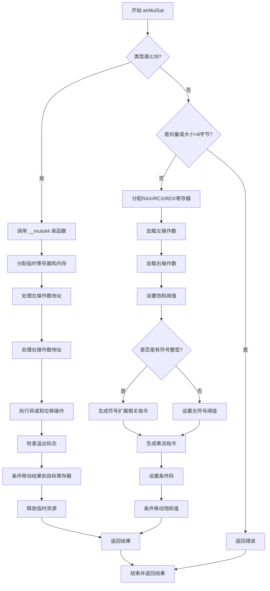

嗯，我需要帮用户把提供的Zig函数`airMulSat`画成流程图。首先，我得先理解这个函数的结构和逻辑流程。

函数`airMulSat`处理的是带饱和的乘法操作。从代码来看，主要分为两个大分支：处理i128类型的情况和其他类型的情况。

首先，函数检查类型是否为i128。如果是，调用`__muloti4`库函数进行乘法，并处理溢出。这里涉及到分配临时寄存器或内存，生成调用指令，处理结果，以及一些条件判断和移动指令。这部分代码里有多个步骤，比如分配寄存器、处理左右操作数、进行异或操作、条件移动等，需要拆解成流程图的节点。

如果类型不是i128，则检查是否为向量类型或大小超过8字节，如果是则返回错误。否则处理常规的乘法，包括溢出检测。这部分涉及寄存器分配、锁存、生成乘法指令、设置条件码，以及最后的条件移动。

接下来，我需要将这两个主要分支转化为流程图。每个条件判断作为菱形节点，不同的处理路径作为分支。比如，首先是判断是否为i128类型，是的话进入i128处理流程，否则进入另一个分支。在第二个分支中，需要判断是否是向量或大小超过8字节，如果是则报错，否则继续处理常规情况。

在处理i128的情况时，流程包括调用库函数、分配寄存器、处理左右操作数的地址、执行异或和位移操作、检查溢出标志、条件移动结果等步骤。这些步骤需要按顺序排列，并连接相应的条件判断。

对于常规情况，流程包括分配和锁定寄存器、加载操作数、生成乘法指令、设置条件码，最后进行条件移动结果。

需要注意的是，流程图中的每个操作步骤应作为矩形节点，条件判断作为菱形节点，箭头表示流程方向。同时，错误处理和函数返回也是流程的一部分。

可能需要将复杂的步骤进一步分解，比如处理左右操作数的部分，是否有符号整数和不同寄存器的处理，这些可能需要子流程或更详细的节点。

最后，确保流程图的逻辑正确，覆盖所有可能的路径，包括错误路径和正常返回路径。
================================================
