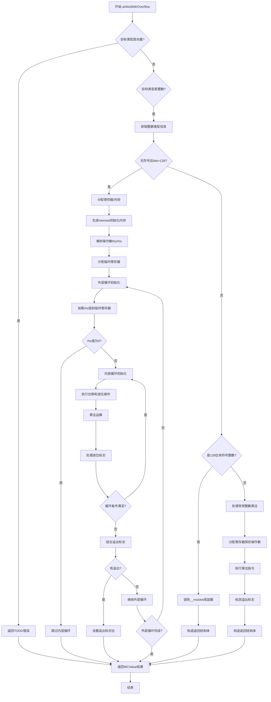

嗯，我需要为这个Zig函数`airMulWithOverflow`画一个流程图。首先，我得理解这个函数的结构和逻辑。函数处理乘法溢出，针对不同的整数类型和情况有不同的处理路径。看起来函数首先检查目标类型是否是向量，如果是的话就返回TODO错误。然后处理整数类型，分为无符号和有符号的情况，可能还涉及到大整数的处理，比如超过128位的无符号整数。接着，函数会根据不同的情况生成不同的机器码，处理寄存器的分配、锁存和释放，以及生成相应的汇编指令。还有处理溢出检测的部分，比如使用条件跳转指令（Jcc）和设置条件码（Setcc）。

我需要把这些逻辑步骤分解成流程图中的各个节点。首先，函数入口，然后根据目标类型是否是向量或整数分支。对于整数类型，进一步检查是否是无符号且超过128位的情况，如果是，执行对应的处理逻辑，包括分配寄存器、生成内联memset、处理操作数、循环结构（外层循环和内层循环）来逐位处理大整数乘法，最后处理溢出标志。如果不是这种情况，则检查是否有其他情况，比如有符号的128位整数，调用库函数`__muloti4`，或者处理更小的整数类型，使用常规的乘法指令和溢出检测。

需要将这些分支和循环结构用流程图表示出来，包括条件判断、循环、寄存器操作、溢出处理等步骤。可能还需要注意错误处理路径，比如返回TODO错误的地方。此外，函数中涉及到多个寄存器操作和汇编指令生成，这些步骤需要被适当抽象，避免流程图过于复杂。

可能遇到的困难是如何将复杂的条件分支和循环结构清晰地表达在流程图中，特别是存在嵌套循环和多个条件判断的情况。需要确保每个判断节点都有明确的是/否分支，并且循环结构有明确的入口和出口。此外，函数中有很多底层操作，如寄存器的分配和锁存，这些在流程图中可能需要简化为几个步骤，比如“分配寄存器”、“生成汇编指令”等，以保持流程图的简洁性。

最后，确定各个步骤之间的连接关系，确保逻辑正确，没有遗漏重要的分支或步骤。可能需要多次迭代，逐步细化和调整流程图的结构，直到准确反映函数的执行流程。
================================================
