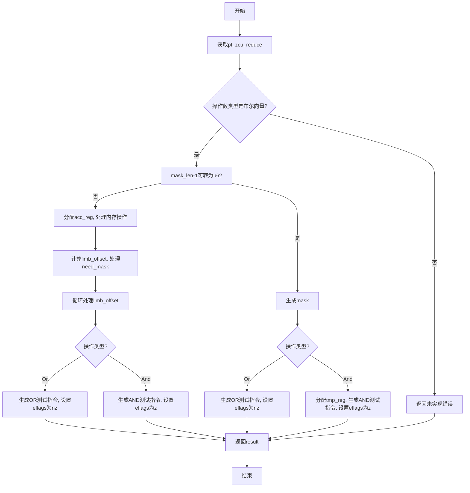

好的，我现在需要为提供的Zig函数`airReduce`绘制流程图。首先，我需要理解这个函数的结构和逻辑。

函数`airReduce`处理一个Air指令，可能是对向量进行某种归约操作。从代码来看，它处理的是布尔类型的向量，并根据不同的归约操作（如Or、And）生成相应的机器码。

首先，函数开始处获取了一些上下文变量，如`pt`、`zcu`和`reduce`。然后进入一个大的代码块，处理`result`的计算。这里有一个条件判断，检查操作数的类型是否是布尔向量。如果是，则进行一系列操作；否则，返回未实现的错误。

在处理布尔向量的情况下，代码分为两种情况：当向量长度减一无法转换为u6时，使用循环处理每个limb（可能是指向量中的元素块），并生成相应的汇编指令。这里涉及到寄存器分配、内存操作以及根据归约操作生成不同的测试指令。例如，对于Or操作，最终设置eflags为nz；对于And操作，比较后设置eflags为z。

另一种情况是当向量长度减一可以转换为u6时，直接生成mask并进行相应的测试操作，同样根据Or或And操作生成不同的汇编指令，并设置eflags。

在流程中，需要注意条件分支，比如`if (operand_ty.isVector(zcu) ...`，以及内部的多个条件判断，如`if (need_mask)`、`switch (reduce.operation)`等。同时，存在循环结构处理limb_offset的递减。

可能的流程节点包括：

1. 开始
2. 获取pt, zcu, reduce
3. 检查操作数是否为布尔向量
4. 处理无法转换为u6的mask长度情况
5. 分配寄存器、处理内存操作
6. 循环处理每个limb_offset
7. 根据操作类型生成测试指令，设置eflags
8. 处理可以转换为u6的mask长度情况
9. 生成相应的测试指令，设置eflags
10. 返回结果或错误

需要注意错误处理的分支，如`return self.fail(...)`。

现在需要将这些步骤转化为Mermaid流程图，合理组织条件判断和循环结构，确保逻辑清晰。
================================================
