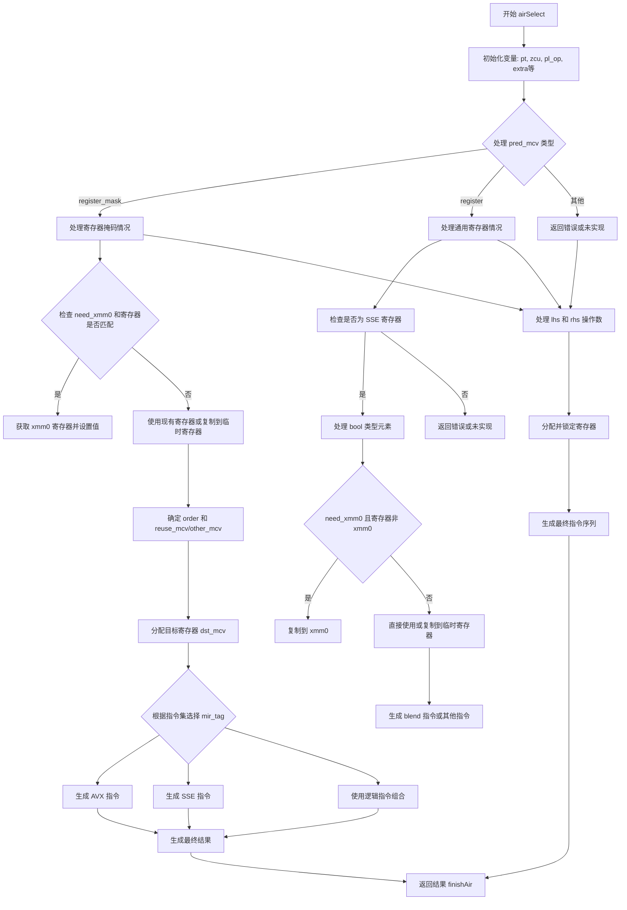

好的，我需要帮助用户用Mermaid画出给定Zig函数的流程图。首先，我需要理解这个函数的结构和逻辑。这个函数叫做airSelect，属于x86_64的代码生成部分。看起来它处理某种选择操作，可能涉及向量或条件选择。

首先，我会通读整个函数，了解各个部分的作用。函数开始时声明了很多变量，比如pt、zcu、pl_op、extra等。然后根据不同的条件分支处理不同的情况，比如检查是否有SSE4.1或AVX指令集支持，处理寄存器掩码，生成不同的汇编指令等。

接下来，我需要确定函数的主要流程。函数大致可以分为以下几个部分：

1. 初始化变量和获取指令的操作数。
2. 处理pred_mcv（预测值的MCValue），根据其类型（寄存器、寄存器掩码等）进行不同的处理。
3. 根据不同的指令集支持（如SSE4.1、AVX）生成相应的汇编指令。
4. 处理左右操作数（lhs和rhs），分配寄存器，处理锁机制。
5. 最终生成结果并返回。

需要注意的是，函数中有多个条件分支，比如根据has_blend和has_avx的值选择不同的路径。此外，还有多个嵌套的switch和if语句，处理不同的寄存器类型和操作数情况。

在绘制流程图时，应该从函数入口开始，按照逻辑顺序逐步展开各个分支。每个条件判断（如检查has_blend、has_avx）需要作为决策节点，不同的分支处理不同的情况。对于每个分支，需要描述其处理步骤，比如分配寄存器、生成汇编指令等。

可能遇到的难点是处理复杂的嵌套条件和多个变量之间的依赖关系。需要确保每个决策点都有明确的分支，并且步骤之间逻辑清晰。另外，函数中使用了多个break和标签（如:mask, :result），需要正确反映在流程图中。

最后，总结整个流程，确保所有可能的路径都被覆盖，并且流程图能够准确反映函数的执行逻辑。
================================================
