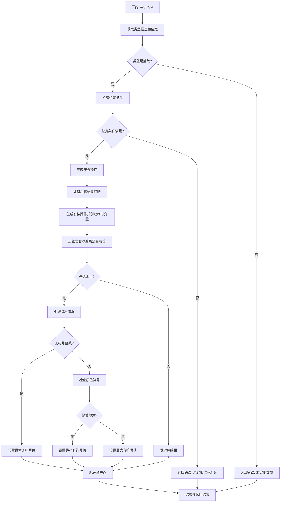

好的，我现在需要为提供的Zig代码绘制流程图。首先，我得仔细阅读并理解这段代码的功能。这段代码是处理带饱和的左移操作（shl_sat），属于编译器后端的一部分，可能是在生成机器码的阶段。

首先，函数`airShlSat`开始处获取了一些类型信息，包括左右操作数的类型和位宽。然后根据左操作数的类型进行不同的处理，这里主要是处理整数类型。接着，代码检查左右操作数的位宽是否符合特定条件，如果不符合则返回错误，提示尚未实现的情况。

接下来，代码生成左移操作，处理不同的目标位置（寄存器、寄存器对、帧加载等），并进行截断。然后生成右移操作，比较原始左移后的结果和右移后的结果，判断是否溢出。如果有溢出，根据有无符号选择最大值或最小值作为饱和结果。

对于有符号整数，还需要检查原值的符号，分别处理正负情况，设置最大值或最小值。最后，将结果返回。

现在，我需要将这些步骤转化为流程图。流程图应该从函数入口开始，按条件分支展开各个处理步骤。需要特别注意条件判断，如类型检查、位宽条件、符号判断等，以及相应的处理路径。

可能需要分块处理：类型判断、左移生成、溢出检查、符号处理等部分。每个判断节点后有不同的分支，比如处理有符号和无符号的情况，以及正负数的不同处理。

需要注意的是，代码中有多个临时变量的创建和释放，以及寄存器的锁定和解锁，这些在流程图中可能不需要详细体现，主要关注控制流的关键节点。

最后，确保流程图的逻辑正确，涵盖所有分支情况，尤其是错误处理和条件跳转部分。
================================================
