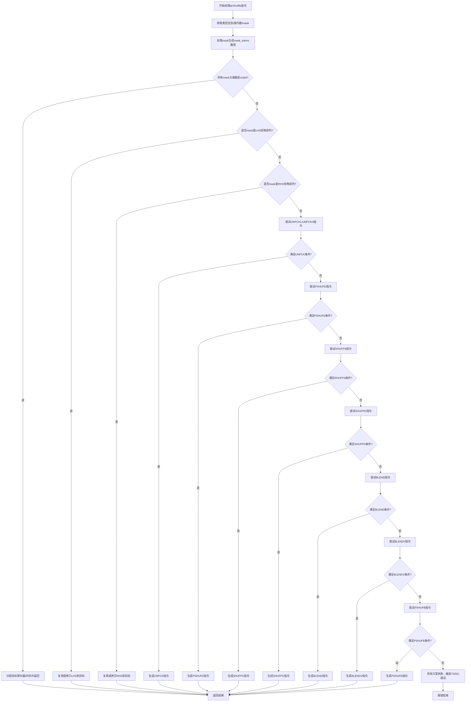

好的，我现在需要帮用户用Mermaid画出给定Zig函数`airShuffle`的流程图。首先，我得仔细理解这个函数的结构和逻辑。

首先，函数开始处理`airShuffle`指令，获取各种类型和操作数信息。然后，它处理mask，生成mask元素数组。接着，函数尝试多种不同的向量操作（如unpckl、unpckh、pshufd、shufps、shufpd、blend、blendv、pshufb等），每个操作都有条件判断，如果满足条件就生成相应的机器码，否则继续尝试下一个可能的操作。如果所有条件都不满足，最后会返回一个错误。

我需要将这些条件分支和操作步骤转化为流程图。每个条件判断对应一个菱形节点，操作步骤对应矩形节点，流程结束用椭圆形。可能的路径包括多个条件分支，比如检查元素大小、是否支持特定指令集（如AVX、SSE4.1等），以及mask是否符合特定模式。

需要注意的是，函数中有多个嵌套的循环和条件判断，比如多个for循环检查mask元素是否符合特定模式。这些循环在流程图中可能需要简化为条件判断，比如“是否所有mask元素满足某种模式”。

此外，每个操作块（如unpck、pshufd等）内部有生成机器码的步骤，这些步骤可以合并为一个处理节点，然后根据是否成功生成结果来决定流程是否继续。

最后，如果所有可能的操作都不适用，函数会触发TODO错误。这也是流程图的终止节点之一。

总结下来，流程图的大致结构是：开始 -> 处理mask -> 依次尝试各种操作条件 -> 成功则生成结果，失败则继续下一个条件 -> 所有条件失败则报错结束。每个条件判断对应分支，操作对应处理步骤。

现在需要将这些步骤用Mermaid语法结构化，确保逻辑清晰，分支正确。
================================================
