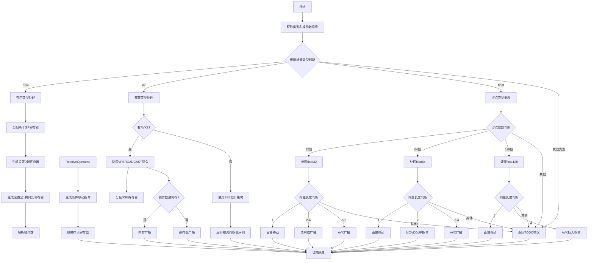

好的，我现在需要为提供的Zig函数`airSplat`绘制流程图。首先，我得仔细阅读代码，理解它的结构和逻辑。

函数`airSplat`处理的是向量化操作，将标量值扩展为向量。代码中根据不同的标量类型（如bool、int、float等）和不同的向量长度，选择不同的指令生成策略。看起来主要分几个大分支：处理布尔类型、整数类型、浮点类型，每个分支内又有不同的情况处理，比如不同的向量长度和不同的CPU特性（如AVX、SSE3等）。

首先，我需要理清函数的主干流程。函数开始获取一些类型和操作数信息，然后进入一个大的switch语句，根据标量类型的不同进入不同的处理分支。每个分支内部可能还有多个条件判断，比如检查CPU特性、向量长度等，从而生成不同的汇编指令。

接下来，我需要将每个分支的逻辑分解成流程图的节点和判断条件。例如，处理布尔类型时，会分配寄存器，生成条件移动指令；处理整数时，根据是否有AVX2特性选择不同的指令；处理浮点数时，根据浮点位数（32、64、128等）和向量长度选择不同的广播或洗牌指令。

需要注意的是，每个分支结束时可能会通过`break :result`返回结果，否则最后会返回一个未实现的错误。此外，代码中有很多条件判断和循环结构，比如`switch`、`if`等，这些都需要在流程图中体现。

在绘制流程图时，应该从函数入口开始，依次处理各个情况，用判断节点（菱形）表示条件分支，用处理节点（矩形）表示具体操作。对于每个分支，需要明确其进入条件和执行的操作，特别是涉及到寄存器分配、指令生成的部分。

可能遇到的挑战是如何将复杂的嵌套条件结构清晰地展现在流程图中，特别是当多个条件（如类型、向量长度、CPU特性）交织在一起时。需要合理组织流程图的层级，避免交叉和混乱。

另外，函数中使用了Zig的一些特定语法，如`switch`表达式、`defer`语句等，这些在流程图中需要适当简化，专注于逻辑流程而非语法细节。

总结步骤：
1. 确定函数入口和初始操作（获取类型信息等）。
2. 根据标量类型分三大分支：bool、int、float。
3. 在每个分支内，进一步根据向量长度和CPU特性细分处理逻辑。
4. 标注每个条件判断的结果（是/否）及对应的处理步骤。
5. 处理完每个情况后，指向结果返回或错误处理。
6. 最后统一到结束节点，返回结果。

需要确保每个可能的执行路径都有对应的流程图路径，特别是错误处理（如未实现的类型返回TODO错误）。
================================================
