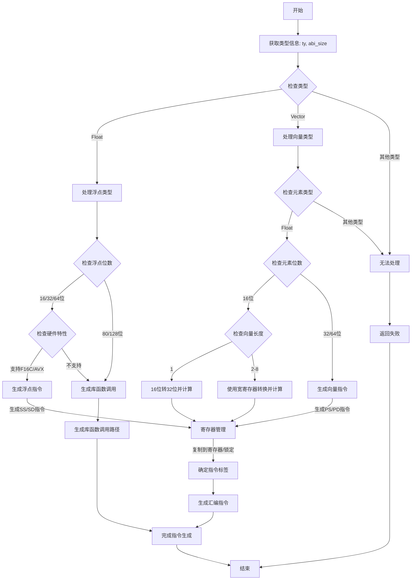

好的，我需要为提供的Zig函数`airSqrt`绘制流程图。首先，我需要理解这个函数的结构和逻辑。

函数`airSqrt`处理生成平方根指令的代码。看起来它根据不同的类型（如浮点数、向量）和硬件特性（如AVX、F16C）生成不同的机器指令。主要步骤如下：

1. **获取类型信息**：确定操作数的类型和大小。
2. **处理浮点类型**：
   - 检查浮点位数，决定是否需要调用库函数（如`__sqrt?`）。
   - 根据不同的浮点精度（16、32、64位）和硬件支持生成相应的指令。
3. **处理向量类型**：
   - 检查子元素类型和向量长度，生成对应的向量指令。
   - 处理16位浮点向量的转换和平方根计算。
4. **寄存器管理**：复制操作数到寄存器，处理寄存器的锁定与解锁。
5. **生成机器指令**：根据不同的情况选择适当的指令标签（`mir_tag`），并生成相应的汇编指令。
6. **返回结果**：最终将结果写入目标寄存器，并完成指令生成。

流程图需要涵盖这些步骤，包括条件判断（如`switch`语句）、循环处理向量元素、寄存器操作和指令生成的不同路径。需要注意条件分支，例如不同的浮点位数、硬件特性支持、向量长度等。

可能的结构：
- 开始
- 解析类型和操作数
- 判断是否为浮点类型
  - 是：检查是否需要调用库函数
    - 需要：生成库函数调用
    - 不需要：处理不同精度和硬件特性生成指令
  - 否：判断是否为向量类型
    - 是：处理向量元素类型和长度
    - 否：错误处理
- 处理寄存器
- 生成指令
- 结束

需要确保所有条件分支都被覆盖，特别是那些涉及硬件特性检查和类型判断的部分。此外，对于向量处理中的不同长度（如1、2-8等），需要相应的分支。

可能需要使用Mermaid的分支节点（菱形）来表示条件判断，矩形节点表示操作，箭头表示流程方向。同时，注意循环或重复结构，如处理不同向量元素时的步骤。

最后，确保流程图的逻辑与代码结构一致，特别是`switch`语句中的各个情况和对应的处理逻辑。
================================================

流程说明：
1. 函数从类型解析开始，根据类型分支处理
2. 浮点类型处理时：
   - 80/128位直接调用库函数
   - 其他精度检查硬件特性支持
   - 支持时生成直接指令，否则调用库函数
3. 向量类型处理时：
   - 16位浮点需要特殊转换处理
   - 不同向量长度使用不同的寄存器策略
4. 寄存器管理阶段处理操作数复用和寄存器分配
5. 最终根据mir_tag生成具体汇编指令
6. 所有路径最终汇聚到结果生成阶段