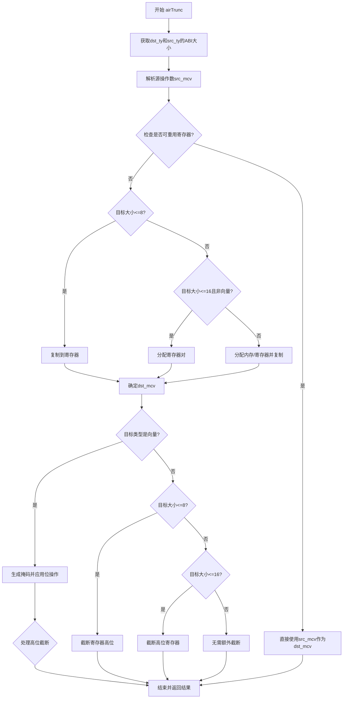

好的，我现在需要帮助用户用Mermaid画出给定Zig函数的流程图。首先，我需要仔细阅读并理解这个函数的结构和逻辑。

这个函数是`airTrunc`，属于代码生成部分，处理截断操作。函数的大致流程如下：

1. **获取类型和大小信息**：从指令中提取目标类型（dst_ty）和源类型（src_ty），并计算它们的ABI大小。
2. **处理源操作数**：解析源操作数的MCV（可能是一个寄存器或内存位置），并根据情况锁定寄存器。
3. **确定目标MCV**：
   - 如果源MCV是寄存器且类型匹配，并且可以重用操作数，则直接使用源MCV。
   - 如果目标大小<=8，复制到寄存器。
   - 如果目标大小<=16且不是向量类型，分配两个寄存器作为寄存器对。
   - 否则，分配内存或寄存器并复制。
4. **处理向量类型**：如果目标类型是向量，进行相应的向量处理，包括生成掩码、应用位操作等。
5. **处理非向量类型的截断**：根据目标大小，可能需要截断高位。
6. **结束并返回结果**：完成指令处理，返回结果。

接下来，我需要将这个过程转化为流程图。需要注意的是条件判断和分支结构，例如不同的目标大小处理、向量与非向量的区分，以及是否重用操作数等。此外，还要处理向量时的不同情况和指令生成。

可能的步骤节点包括：
- 开始
- 获取类型和ABI大小
- 解析源操作数
- 确定是否重用操作数或复制到寄存器/寄存器对/内存
- 处理向量类型
- 处理非向量类型的截断
- 结束并返回

需要确保条件分支正确连接，比如不同的目标大小处理路径，以及向量处理中的各种情况（如AVX特性检查等）。

可能会遇到复杂的情况，比如向量处理部分中的多个条件判断，需要仔细梳理每个条件对应的路径。同时，要注意循环或递归结构，但在这个函数中似乎没有明显的循环，主要是条件分支。

最后，根据上述分析，用Mermaid语法绘制流程图，使用不同的节点和箭头表示流程走向，确保逻辑清晰准确。
================================================
