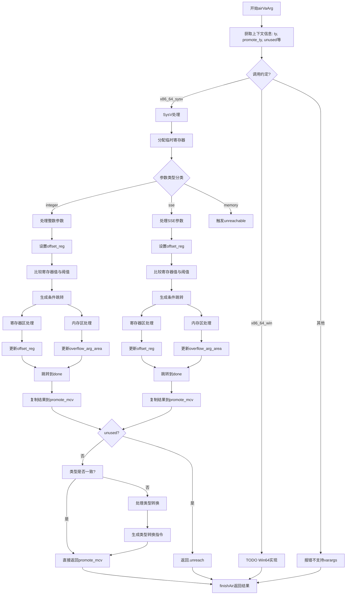

好的，我现在需要帮用户用Mermaid画出他们提供的Zig函数`airVaArg`的流程图。首先，我需要仔细阅读并理解这个函数的逻辑结构。

函数`airVaArg`处理可变参数（varargs）的生成代码，特别是针对x86_64架构的System V和Windows调用约定。看起来主要逻辑集中在处理System V的情况，而Windows部分还未实现。

首先，我会梳理函数的主要步骤：

1. **函数开始**：获取一些上下文信息，比如类型、操作数等。
2. **根据调用约定分支处理**：这里分为`.x86_64_sysv`和`.x86_64_win`，以及其他的错误情况。
3. **System V处理流程**：
   - 分配临时寄存器。
   - 根据参数类型（整数类、SSE类、内存类等）进行不同的处理。
   - 生成相应的汇编指令，处理寄存器和内存偏移。
   - 处理未使用的指令情况，以及类型提升后的结果复制。
4. **结果返回**：根据是否使用结果，决定最终的MCValue，并结束指令生成。

接下来，我需要将这些步骤转化为流程图中的节点和判断条件。需要注意的条件包括调用约定类型、参数类型分类（integer、sse、memory）、是否未使用（unused）、类型是否需要提升等。

可能的结构如下：

- 开始节点。
- 判断调用约定，分为SysV、Win64、其他错误。
- 对于SysV，进一步根据参数类型分支到integer、sse、memory处理。
- 每个参数类型分支内部处理寄存器和内存操作，生成相应的汇编代码。
- 处理完成后，判断是否未使用（unused），如果是，返回unreach，否则处理类型提升和结果复制。
- 最终返回结果，结束。

需要注意循环和条件跳转的位置，比如在生成比较和跳转指令时，可能有条件跳转到不同的代码块，这在流程图中需要用条件节点表示。

此外，内存类的处理目前是unreachable，所以这部分可能直接标记为未实现或错误。

在绘制流程图时，需要确保每个判断和操作步骤清晰，并用正确的箭头连接，特别是条件分支后的不同路径。同时，错误处理和未实现的部分也需要明确标出。

最后，根据上述分析，整理成Mermaid的流程图语法，确保结构正确，节点和箭头正确对应函数中的逻辑。
================================================
