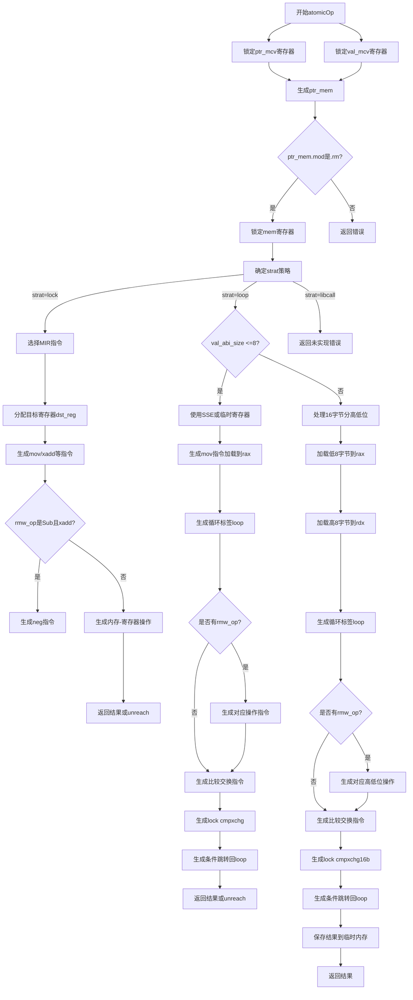

好的，我需要为这个Zig函数`atomicOp`画一个流程图。首先，我得仔细理解这个函数的逻辑结构和各个分支。看起来这个函数处理原子操作，根据不同的情况选择不同的策略，比如使用锁、循环或者libcall。

首先，函数开始时会锁定相关的寄存器，然后根据`ptr_mcv`的类型生成`ptr_mem`。如果`ptr_mem.mod`不是`.rm`，就会返回错误。接着根据`use_sse`和`strat`的枚举值选择不同的策略：`.lock`、`.loop`或`.libcall`。

对于`.lock`策略，会根据`rmw_op`生成不同的MIR指令，操作寄存器并生成相应的汇编指令。然后处理返回值。

对于`.loop`策略，分为两种情况：`val_abi_size`小于等于8或者更大。对于小尺寸，使用SSE寄存器或临时寄存器，生成循环比较和交换指令。对于大尺寸（如16字节），分高低位处理，同样生成循环结构。

`.libcall`策略暂时未实现，直接返回错误。

流程图需要涵盖这些主要分支，包括错误处理、寄存器锁定与释放、策略选择以及各策略下的详细步骤。需要注意条件判断和循环结构，确保流程图的连贯性和准确性。可能需要使用不同的形状表示不同的步骤，如菱形表示条件判断，矩形表示操作，箭头表示流程方向。

现在，根据这些分析，画出对应的Mermaid流程图。
================================================
