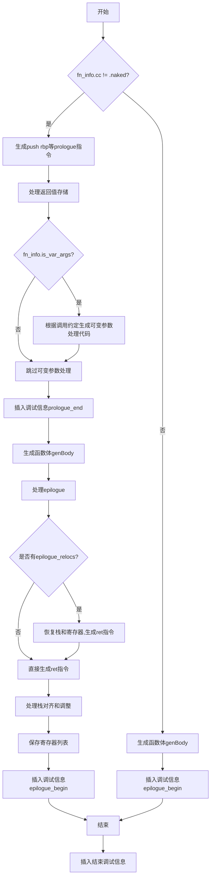

嗯，我需要用Mermaid来画出这个Zig函数的流程图。首先，我得仔细阅读并理解这个函数的逻辑。这个函数看起来是负责生成汇编代码的，特别是处理函数的前导（prologue）和结尾（epilogue），包括栈帧的设置、保存寄存器、处理可变参数等等。

首先，函数开始检查是否是非naked调用（fn_info.cc != .naked）。如果是，就生成push rbp等指令，设置栈帧。这里有几个占位符（backpatch_push_callee_preserved_regs等），后面会根据计算的结果来填充这些指令。然后处理返回值的存储，如果是间接返回，需要将地址保存到栈上。接着处理可变参数的情况，根据不同的调用约定（SysV或Win64）来生成相应的代码。

之后是生成函数体（genBody），然后是处理结尾部分（epilogue），恢复栈帧和寄存器，返回等。如果有调试信息，还会插入相关的伪指令。

接下来需要考虑各种条件分支，比如是否需要对齐栈帧（need_frame_align）、是否需要调整栈指针（need_stack_adjust）、是否需要保存寄存器（need_save_reg）等。每个条件分支对应不同的指令生成。

对于流程图，应该从函数入口开始，根据不同的条件分支画出不同的路径。比如，首先判断是否是naked函数，如果是，直接生成函数体；否则，处理prologue、保存寄存器、处理返回值和可变参数，生成函数体，然后处理epilogue。在epilogue部分，可能需要恢复栈和寄存器，最后返回。

需要注意的是，流程图中要体现各个条件判断，比如if (fn_info.cc != .naked)、处理可变参数的条件判断、是否需要栈对齐、是否需要调整栈指针等。同时，循环结构比如for循环保存寄存器也需要在流程图中体现。

另外，占位符的处理（backpatch）可能在流程图中需要特殊表示，比如先预留位置，后续再填充具体指令。但可能为了简化，可以将这些步骤合并到主流程中，用条件判断来表示。

最后，函数结束部分插入调试信息，并处理结束标签。

可能还需要考虑错误处理，比如try语句中的错误返回，但流程图可能不需要详细展示错误路径，主要关注正常流程。

总结一下，流程图的大致步骤是：

1. 检查是否是naked函数。
   - 如果是，生成函数体，插入调试信息，结束。
   - 如果不是，继续处理prologue。
2. 处理prologue：保存寄存器，设置栈帧，处理返回值地址，处理可变参数。
3. 生成函数体。
4. 处理epilogue：恢复栈和寄存器，返回。
5. 根据不同的条件（栈对齐、栈调整等）生成相应的指令。
6. 插入调试信息。

现在需要将这些步骤转化为Mermaid的流程图语法。注意使用条件判断节点（菱形）和不同的执行块（矩形）。可能需要分层处理，比如在prologue部分有多个子条件，需要分别处理。
================================================
