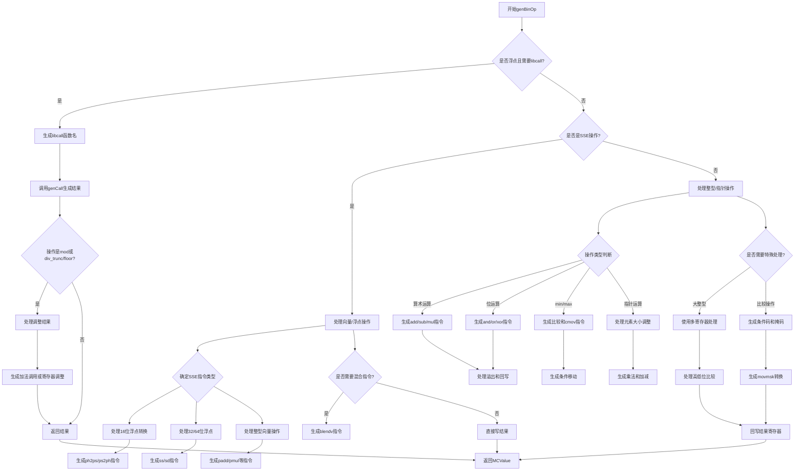

嗯，我现在需要为这个Zig函数`genBinOp`画一个流程图。首先，我得仔细看看这个函数的结构，了解它的主要步骤和分支。这个函数看起来是处理二进制操作的代码生成，涉及不同类型的操作数，比如整数、浮点数、向量等，并且根据不同的条件和目标架构生成不同的机器指令。

首先，函数开始部分处理浮点数的库调用，特别是当浮点数的位数较大（如80、128位）或者需要特定的库函数（如rem、mod）时。这里有一个条件判断，如果类型需要库调用，就会生成相应的函数名并调用。接着处理模运算后的调整，可能需要额外的加法操作，或者使用寄存器来处理不同的浮点格式，比如16位浮点数需要转换到更高的精度再操作。

然后，代码处理SSE操作，检查类型是否为浮点数或向量，并根据不同的元素类型和操作符生成对应的SSE指令。这部分有很多条件分支，根据不同的操作符（如add、sub、mul等）和数据类型（如32位、64位浮点，不同长度的向量）选择不同的机器指令。这里还涉及到寄存器的分配和锁定，确保操作数在正确的寄存器中。

接下来是处理整数和位操作的逻辑，包括加减乘除、位与、位或、异或等操作。对于较大的整数（如超过8字节），需要使用多个寄存器进行处理，并生成相应的比较和条件移动指令。这里还处理了指针的加减操作，需要考虑元素大小并进行乘法调整。

在处理比较操作时，代码生成不同的条件码，并根据比较结果设置寄存器。对于向量比较，可能需要将结果转换为掩码，并进一步处理。

最后，函数处理各种特殊情况，如不同的浮点舍入模式（trunc、floor），以及处理NaN值的情况，使用混合指令（如blendv）来选择正确的结果。

整个函数中有大量的条件判断，根据不同的操作类型、数据类型、目标架构特性（如AVX、SSE4.1等）来选择生成不同的指令。同时涉及寄存器的分配、锁定和释放，确保资源正确管理。

现在，我需要将这些步骤和分支整理成一个流程图。流程图的开始是函数入口，然后根据不同的条件分支处理不同的情况，比如是否需要库调用、是否是SSE操作、处理整数还是浮点数、不同的操作符类型等。每个分支下可能还有子分支，比如不同的浮点位数、向量长度、是否支持特定的指令集扩展等。

需要注意的是，由于代码非常复杂，流程图可能会非常庞大，因此需要适当简化，抓住主要的分支和关键步骤，避免陷入过多的细节。同时，使用Mermaid的语法结构，如条件判断（菱形框）、处理步骤（矩形框）、子流程（子图）等来组织流程图。
================================================

这个流程图展示了：
1. 初始的库调用判断分支
2. SSE向量/浮点操作处理路径
3. 常规整型/指针操作处理路径
4. 混合结果处理路径
5. 最终结果返回的统一出口

主要分支点用菱形表示，处理步骤用矩形表示，关键子操作通过不同颜色路径区分。实际代码中每个判断分支都包含更复杂的子条件，这里进行了合理简化以保持流程图的可读性。