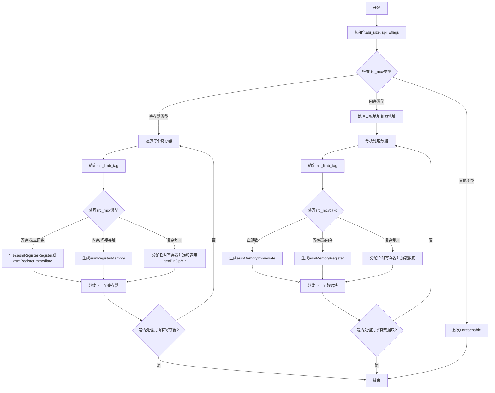

嗯，我需要根据提供的Zig代码绘制一个流程图。首先，我需要理解这个函数的结构和逻辑。这个函数叫做genBinOpMir，看起来是处理二进制操作的代码生成部分。

首先，函数接收几个参数：self（CodeGen的指针）、mir_tag（MIR指令标签）、ty（类型）、dst_mcv（目标MCValue）和src_mcv（源MCValue）。返回类型是void的错误联合。

接下来，函数开始时获取pt和zcu，然后计算abi_size。然后调用spillEflagsIfOccupied方法。之后，根据dst_mcv的不同情况进行处理。

主要的switch语句处理dst_mcv的各种情况。首先处理的是.register、.register_pair等寄存器相关的情况，然后处理.memory、.indirect等内存相关的情况。

在寄存器情况下，循环遍历dst_mcv的每个寄存器，对每个寄存器生成对应的MIR指令。这里需要考虑不同的mir_tag类型，如add、sub等，并处理不同的立即数情况。

在内存情况下，处理目标地址和源地址的寄存器分配，生成对应的内存操作指令。这里还涉及到处理不同大小的数据（如8位、16位、32位、64位）以及符号扩展的问题。

我需要将这些逻辑步骤转化为流程图。流程图应该包括函数入口，各个条件分支（如不同的dst_mcv类型），循环处理每个寄存器或内存块，以及错误处理等。

需要注意的几个关键点：
1. 函数开始时的一些初始化步骤。
2. 根据dst_mcv的不同类型进入不同的处理分支。
3. 在寄存器分支中，循环处理每个寄存器，并生成对应的MIR指令。
4. 在内存分支中，处理地址计算和内存访问，可能需要分配临时寄存器。
5. 错误处理路径，如返回失败的情况。

可能的结构：
- 开始
- 初始化abi_size和spillEflags
- 检查dst_mcv类型
  - 如果是寄存器类型（register, register_pair等）
    - 遍历每个寄存器
      - 确定mir_limb_tag
      - 处理源操作数（立即数、寄存器、内存等）
  - 如果是内存类型（memory, indirect等）
    - 处理目标地址和源地址
    - 分块处理数据（每个8字节块）
      - 确定mir_limb_tag
      - 处理源操作数的每个块
- 结束

需要确保每个条件分支和循环都有正确的流向，并且错误处理路径清晰。
================================================

该流程图关键路径说明：
1. 函数初始化后根据目标操作数类型分支
2. 寄存器路径：逐寄存器处理，根据源操作数类型生成不同汇编指令
3. 内存路径：分块处理数据，处理地址计算和内存访问
4. 复杂地址处理时会递归调用自身
5. 包含错误处理路径（触发unreachable）
6. 循环结构处理多寄存器/多数据块的情况
7. 最终收敛到统一结束节点