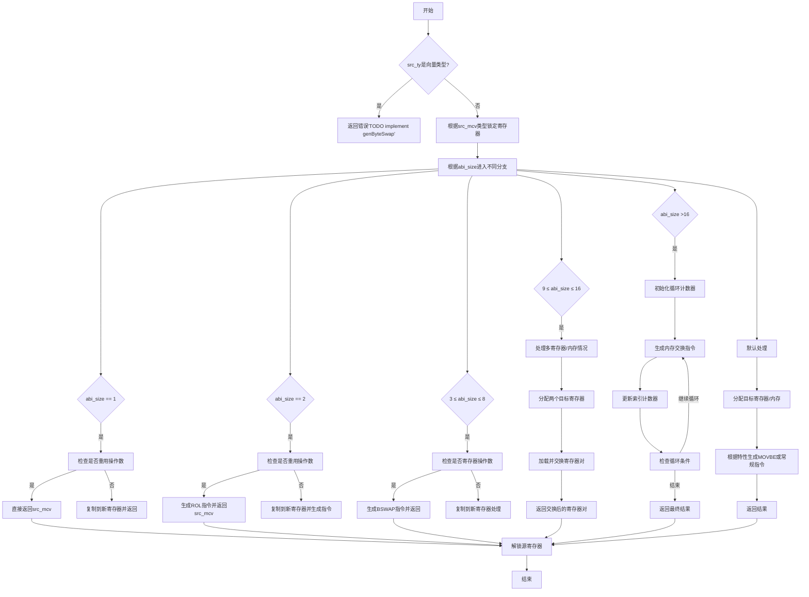

好的，我现在需要为提供的Zig函数`genByteSwap`绘制流程图。首先，我需要理解这个函数的功能和结构。

函数`genByteSwap`似乎负责生成字节交换的机器代码。根据不同的情况（如数据类型的大小、是否使用特定指令集等），它会有不同的处理逻辑。我需要仔细阅读代码，理清各个条件分支和处理步骤。

首先，函数开始处有一些变量声明，比如`pt`、`zcu`、`ty_op`等。然后检查`src_ty`是否为向量类型，如果是，则返回未实现的错误。

接下来，根据`src_mcv`的类型（寄存器或其他）锁定寄存器，并在处理完成后解锁。这里有一个`defer`语句，确保在函数返回前释放锁定的寄存器。

然后根据`abi_size`（类型的ABI大小）进入不同的处理分支：

1. **abi_size == 1**：直接复制到寄存器或重用操作数。
2. **abi_size == 2**：生成移位指令（可能重用操作数）。
3. **abi_size 3-8**：使用`bswap`指令。
4. **abi_size 9-16**：处理更复杂的情况，可能需要分配多个寄存器或使用内存操作。
5. **abi_size >16**：处理非常大的类型，使用循环进行字节交换。

每个分支内部还有进一步的判断，比如是否重用操作数、是否使用`movbe`指令等。特别是对于较大的类型（如9-16字节和更大），会涉及到内存操作、寄存器分配和循环结构。

在分析过程中，我需要将这些条件分支和操作步骤转化为流程图中的不同节点和判断框。例如，函数开始时检查是否为向量类型，如果是则报错；然后根据不同的`abi_size`进入不同的处理路径；每个路径内部可能有更多的条件判断和操作。

需要注意的是，对于较大的类型（如9-16字节），代码会分配多个寄存器或使用内存操作，并可能生成相应的汇编指令。而对于非常大的类型（超过16字节），则会使用循环结构逐个处理每个字节或字。

另外，代码中涉及到寄存器管理和锁定机制，这在流程图中可能需要以不同的步骤表示，比如分配寄存器、锁定、使用后解锁等。

在绘制流程图时，需要确保每个条件分支（如switch-case）都被正确表示，各个处理步骤之间的流向清晰。例如，对于`abi_size`的不同值，会有不同的处理块，每个块内部可能还有子条件。

最后，需要确保流程图的结束点正确，即每个分支最终返回相应的`MCValue`结果。

在总结过程中，可能需要将整个函数分解为以下几个主要部分：

1. 初始检查和错误处理（向量类型）。
2. 根据abi_size分发的不同处理逻辑。
3. 各个大小分支的具体操作（寄存器分配、指令生成等）。
4. 最终返回结果。

每个部分在流程图中应作为一个节点或判断框，通过箭头连接表示执行顺序和条件分支。
================================================
