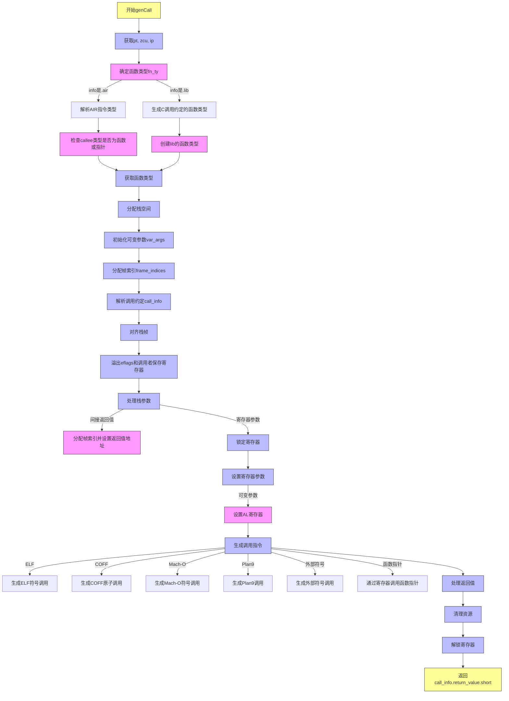

嗯，我现在要帮用户用Mermaid画出一个Zig函数的流程图。这个函数叫genCall，属于x86_64的代码生成部分。首先，我得仔细看看这个函数的代码结构，理解它的逻辑流程。

首先，函数genCall的参数是一个联合类型info，可能来自AIR指令或库调用。然后处理参数类型、参数值和一些选项。函数内部有很多条件分支和循环，比如处理不同的调用约定、参数传递方式，还有生成汇编指令等。

我需要先分解函数的各个步骤。函数开始的时候，获取pt、zcu和ip。接着根据info的类型（.air或.lib）确定函数类型fn_ty。然后分配栈空间，处理变量参数var_args和帧索引frame_indices。之后处理寄存器的锁定和解锁，解析调用约定，设置栈参数和寄存器参数，生成调用指令，最后处理返回值和清理资源。

流程图中需要涵盖各个分支，比如处理不同的调用约定（如x86_64_sysv和x86_64_win），处理间接返回值的处理，以及根据不同二进制文件类型（ELF、COFF、Mach-O、Plan9）生成不同的调用指令。此外，还有处理外部符号和函数指针的情况。

需要注意的是，函数中有很多条件判断和错误处理，比如try语句可能跳转到错误处理流程。同时，变量参数和寄存器的分配需要详细步骤。在处理参数时，分为栈参数和寄存器参数，并且要考虑寄存器的锁定和解锁，避免冲突。

可能还需要考虑不同目标平台的特殊处理，比如ELF和Mach-O的符号处理方式不同，需要不同的生成逻辑。此外，处理可变参数函数时，需要设置AL寄存器的值。

最后，函数返回call_info.return_value.short作为结果。整个流程需要按照顺序，将各个步骤用流程图节点表示，并用箭头连接，条件判断用分支表示，循环部分也需要适当表示。

现在，我需要将这些步骤整理成一个结构化的流程图，使用Mermaid的语法。可能需要将主流程分为几个大块，比如初始化、参数处理、寄存器分配、调用生成、清理等，然后在每个大块下细分步骤。同时，注意处理不同情况的分支，如不同的info类型、不同的调用约定、不同的二进制文件格式等。
================================================
