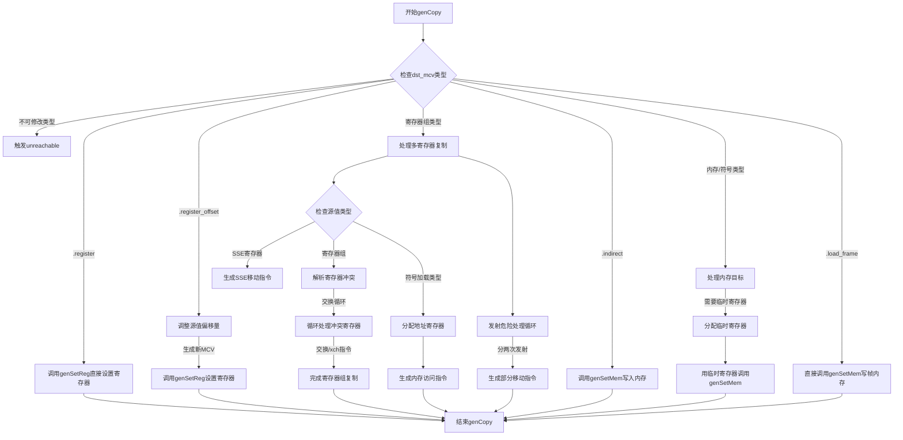

好的，我需要为提供的Zig函数`genCopy`绘制流程图。首先，我需要理解这个函数的结构和逻辑。

函数`genCopy`的主要功能是生成代码来复制数据，根据不同的目标地址类型（`dst_mcv`）和源地址类型（`src_mcv`）执行不同的操作。函数内部有一个`switch`语句，针对`dst_mcv`的不同情况进行处理。

首先，我会逐行分析代码，确定各个分支的逻辑：

1. **处理不可修改的目标（unreachable情况）**：当`dst_mcv`是`.none`、`.unreach`等不可修改的情况时，直接触发`unreachable`。

2. **目标为寄存器（.register）**：直接调用`genSetReg`将源值设置到目标寄存器。

3. **目标为寄存器偏移（.register_offset）**：需要调整源值的偏移量，然后调用`genSetReg`。

4. **目标为寄存器组（如.register_pair等）**：处理多个寄存器的复制，可能需要处理寄存器冲突，生成多条指令。

5. **目标为间接地址（.indirect）**：调用`genSetMem`将源值写入内存地址。

6. **目标为内存地址或符号加载（.memory、.load_symbol等）**：计算目标地址，可能需要临时寄存器，然后调用`genSetMem`。

7. **目标为帧地址（.load_frame）**：直接调用`genSetMem`处理帧地址。

接下来，我需要将这些逻辑分支转化为流程图。每个`case`在流程图中应作为一个决策节点，后续操作作为子流程或步骤。

需要注意的是，某些分支内部还有嵌套的`switch`或条件判断，例如处理寄存器组时需要考虑源值的类型，并可能生成不同的汇编指令。此外，处理寄存器冲突和危险（hazard）情况需要循环处理。

在绘制流程图时，应确保每个主要分支都有清晰的路径，并合理处理循环和条件嵌套。可能需要在流程图中使用子流程来表示复杂的逻辑块，例如处理寄存器组复制时的循环和条件判断。

最后，需要检查是否有遗漏的分支或未处理的情况，确保流程图全面覆盖函数的所有可能路径。
================================================
