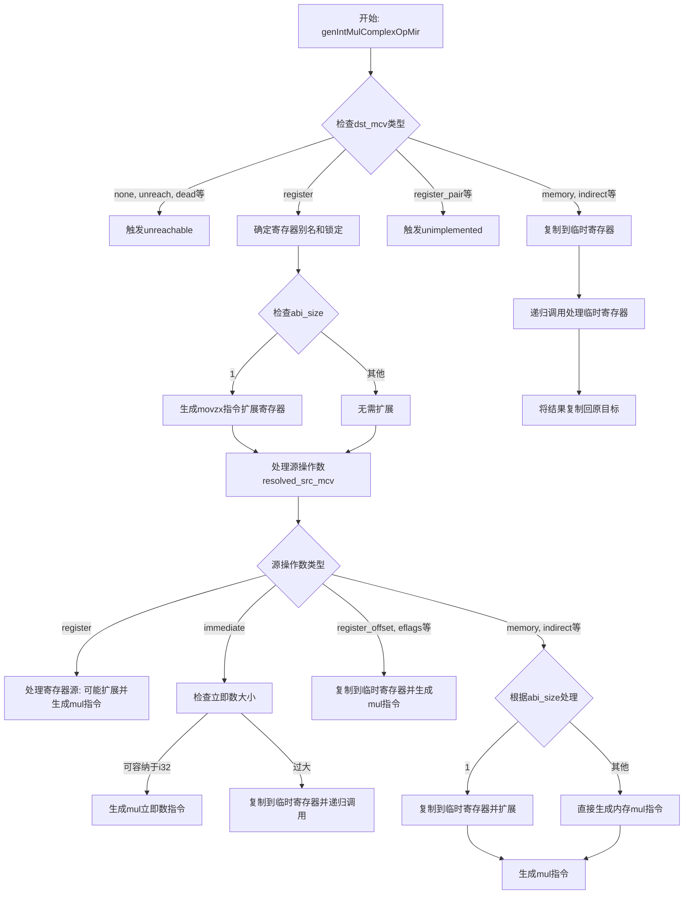

好的，我需要为提供的Zig函数`genIntMulComplexOpMir`绘制一个流程图。首先，我会仔细阅读代码，理解其结构和逻辑。

函数的主要目的是处理整数乘法操作，根据不同的`dst_mcv`（目标操作数）和`src_mcv`（源操作数）的类型生成相应的机器指令。代码中使用了大量的模式匹配（switch语句）来处理不同的情况。

首先，函数检查`dst_mcv`的类型。对于不可修改的目标类型（如`.none`, `.unreach`等），直接触发`unreachable`。当目标类型是寄存器（`.register`）时，处理更复杂的情况，包括处理不同大小的寄存器别名，生成`movzx`指令（对于1字节的情况），然后根据源操作数的类型（寄存器、立即数、内存地址等）生成相应的乘法指令（`mul`）。

如果目标类型是内存或间接寻址（如`.memory`, `.indirect`等），则先将目标值复制到临时寄存器，执行乘法操作，再将结果复制回原目标。

接下来，我需要将这些逻辑步骤转化为流程图。流程图应包含以下主要步骤：

1. 函数开始，检查`dst_mcv`的类型。
2. 对于不可修改的目标类型，触发错误。
3. 处理目标为寄存器的情况：
   - 确定寄存器别名。
   - 处理不同abi_size（如1字节需要扩展）。
   - 处理源操作数的不同类型（寄存器、立即数、内存等）。
4. 处理目标为内存或间接寻址的情况：
   - 复制到临时寄存器。
   - 递归调用函数处理临时寄存器作为目标。
   - 将结果复制回原目标。
5. 处理未实现的多寄存器情况（如`.register_pair`）。

需要注意的条件分支和循环（如递归调用）也需要在流程图中体现。例如，当处理立即数时，如果立即数过大，会递归调用自身处理临时寄存器的情况。

最后，确保流程图清晰展示各个判断分支和操作步骤，使用合适的符号（如菱形表示判断，矩形表示操作，箭头表示流程方向）。
================================================
