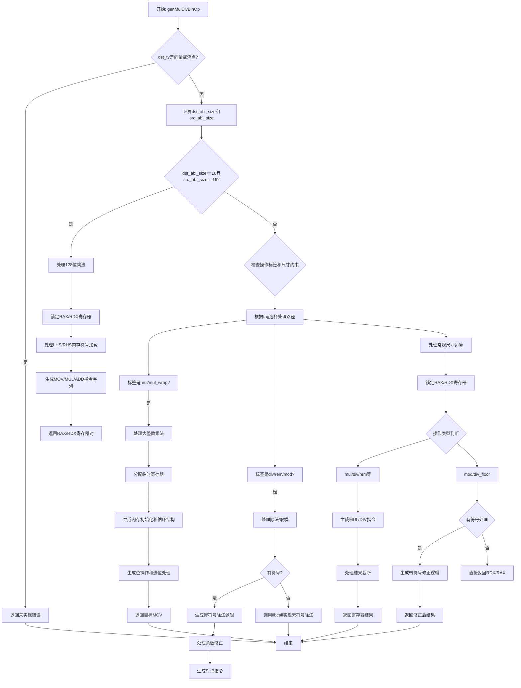

嗯，我需要为提供的Zig函数genMulDivBinOp绘制流程图。首先，我得理解这个函数的结构和逻辑。函数看起来处理乘法和除法的二进制操作，根据不同的标签（tag）和类型（dst_ty, src_ty）生成相应的机器码。

首先，函数开始检查目标类型是否为向量或浮点数，如果是，则返回未实现的错误。接着处理不同的大小情况，比如当dst_abi_size和src_abi_size都是16时，执行特定的乘法逻辑。之后，根据不同的操作标签（如mul, div_trunc等），处理不同大小的整数运算，包括锁定寄存器、生成汇编指令、处理溢出等。

我需要将整个函数分解成主要的逻辑块，并根据条件分支连接这些块。例如，函数中有多个条件判断，如检查dst_abi_size和src_abi_size是否为16，不同的操作标签（tag）对应的不同处理逻辑，以及根据有符号或无符号选择不同的路径。

可能的步骤：
1. 开始函数，检查是否为向量或浮点类型，如果是，返回错误。
2. 处理dst_abi_size和src_abi_size均为16的情况，执行特定乘法逻辑。
3. 检查操作标签，判断是否需要处理大整数乘法或除法，进入不同的处理分支。
4. 对于不同的标签（如mul, div_trunc, rem等），生成相应的机器码，处理寄存器分配和汇编指令。
5. 处理有符号和无符号的不同情况，例如在mod操作中区分有符号和无符号的处理方式。
6. 返回结果，可能需要将结果存储在寄存器对或内存中。

需要注意的条件分支和循环，例如在处理大整数时可能有循环结构，但根据代码中的标签和跳转指令，可能需要在流程图中表示这些循环。不过，由于代码中使用的是内联汇编和生成机器指令，实际的循环可能是在生成的汇编代码中，而不是在Zig函数本身的流程中。

可能需要将每个主要的条件判断（如if、switch语句）作为决策节点，然后根据不同的路径绘制子流程。例如，处理dst_abi_size == 16的情况，然后处理不同的操作标签，再根据有符号性进一步分支。

最后，整理这些逻辑块，用mermaid的流程图语法表示出来，确保每个判断和操作都有对应的节点和箭头连接。
================================================

这个流程图展示了：
1. 初始类型检查
2. 128位乘法的特殊处理路径
3. 大整数乘法的循环实现
4. 除法/取模操作的分支（包含有符号/无符号差异）
5. 常规尺寸运算的统一处理
6. MOD/DIV_FLOOR的特殊修正逻辑
7. 最终结果返回路径

各主要决策点使用菱形节点表示，操作步骤使用矩形节点，不同颜色可用于区分错误处理、寄存器操作、内存操作等逻辑区块。