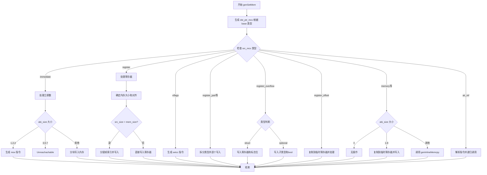

嗯，我需要为提供的Zig函数`genSetMem`绘制一个流程图。首先，我应该先理解这个函数的结构和逻辑流程。看起来这个函数主要是处理内存设置的操作，根据不同的`src_mcv`类型采取不同的处理方式。

首先，函数开始的时候，处理了`base`参数，生成`dst_ptr_mcv`。然后进入一个大的`switch`语句，根据`src_mcv`的不同情况来处理不同的内存设置逻辑。每个`case`里面可能有不同的操作，比如处理立即数、寄存器、标志位、寄存器对、寄存器溢出等等。

接下来，我需要将这些分支逐一理清楚。例如，当`src_mcv`是`.immediate`时，根据`abi_size`的大小有不同的处理方式。如果`abi_size`是1、2、4，就直接生成对应的`mov`指令；如果是更大的值，可能需要分块处理。而当`src_mcv`是`.register`时，会涉及到寄存器别名、内存对齐、可能的帧分配等复杂逻辑。

另外，还有一些特殊情况，比如`.register_overflow`需要处理结构体或可选类型，`.register_offset`可能需要复制到临时寄存器并进行地址计算，`.memory`或其他间接访问可能需要调用`genInlineMemcpy`等。

在绘制流程图时，应该从函数入口开始，然后按照各个`switch`分支分支出不同的路径。每个分支内部可能有条件判断（比如`abi_size`的大小）或循环（如分块写入内存）。需要确保每个条件判断和循环都被正确表示，并且各个步骤之间的流向清晰。

需要注意的是，有些分支可能会调用其他函数（如`genInlineMemset`、`asmSetccMemory`、`moveStrategy`、`allocFrameIndex`等），这些在流程图中可能需要简化为一个步骤，或者展开更详细的子流程，但根据要求，可能不需要深入到这些函数内部，只需标明调用即可。

另外，错误处理部分（`InnerError!void`）可能涉及到返回错误，但流程图中是否需要体现错误路径呢？可能只需要关注正常流程，除非特别重要。

总结一下，流程图的步骤大致如下：

1. 函数开始，处理`base`生成`dst_ptr_mcv`。
2. 根据`src_mcv`的类型进入不同的处理分支。
3. 每个分支内部根据不同的条件（如`abi_size`、类型标签等）执行相应的操作。
4. 可能的子流程调用，如生成指令、分配帧索引、复制到临时寄存器等。
5. 处理完成后返回。

在绘制时，使用Mermaid的流程图语法，用不同的节点表示各个步骤，条件判断用菱形节点，分支用箭头连接，循环用箭头回指。需要确保结构清晰，层次分明，避免交叉线过多导致混乱。

可能遇到的困难是代码中的嵌套`switch`和条件较多，需要合理组织流程图的结构，避免节点过多。可以考虑将复杂的子分支单独成块，或者使用子图来分组。

现在，根据上述分析，开始绘制Mermaid流程图。
================================================

流程图说明:
1. 函数入口生成目标内存地址(dst_ptr_mcv)
2. 根据源操作数类型(src_mcv)进行多路分支
3. 主要处理路径包括:
   - 立即数分不同大小处理
   - 寄存器操作涉及内存对齐判断
   - 标志寄存器生成setcc指令
   - 复合寄存器类型拆分写入
   - 寄存器溢出处理结构体和可选类型
   - 内存间接访问调用memcpy
   - AIR指令递归解析
4. 所有路径最终汇聚到结束节点
5. 使用条件判断节点(菱形)处理不同参数情况
6. 复杂操作(如帧分配)用子流程表示