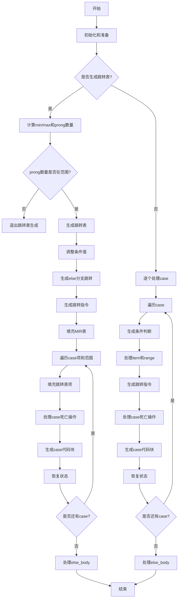

嗯，我需要画这个函数的流程图。首先，我得仔细读一遍代码，理解它的结构和逻辑。这个函数叫lowerSwitchBr，看起来是处理switch分支的代码生成。函数参数里有CodeGen、指令索引、switch_br结构体、条件值等等。

首先，函数开始处理一些条件类型的信息，获取整数类型的信息。然后有一个ExpectedContents的结构，可能是用来分配内存的。接着用stackFallback分配器，可能是为了临时内存分配。保存当前状态，处理活跃性分析，获取switch分支的活跃信息。

接下来有一个大的if条件，检查是否非PIC（位置无关代码）且目标格式是ELF。这里可能是在处理生成跳转表的情况。如果满足条件，会计算各个case的范围，找出最小和最大值，然后生成跳转表。这里有很多关于处理case项和范围的代码，比如遍历case项，处理每个item和range，填充跳转表。然后生成条件比较，处理else分支，生成跳转指令，更新MIR表等等。如果不满足这个条件，就进入另一个处理流程，逐个处理每个case，生成条件判断和跳转指令。

在else情况下，遍历每个case，生成条件比较，处理每个item和range，生成对应的跳转指令。处理完所有case后，处理else_body，生成对应的代码块。

我需要将整个流程拆分成几个主要步骤：

1. 初始化和准备工作：获取类型信息，分配内存，保存状态，处理活跃性分析。
2. 判断是否生成跳转表：检查条件，计算min和max，处理case项，生成跳转表。
3. 生成跳转表相关代码：条件调整，生成跳转指令，填充MIR表，处理case项和范围。
4. 处理else分支：如果有else_body，生成对应的代码。
5. 如果不生成跳转表，逐个处理每个case：生成条件判断，处理item和range，生成跳转指令，处理else_body。

可能的分支点在于是否生成跳转表，这会分为两种不同的处理路径。每个case处理中又可能有循环处理多个item和range，生成对应的条件判断和跳转。

流程图需要包括开始、初始化、条件判断（是否生成跳转表）、两种处理路径、处理每个case、处理else，最后结束。

要注意循环结构，比如遍历case的循环，以及处理每个item和range的循环。此外，错误处理和内存释放也需要考虑，但可能不需要在流程图中详细体现。

现在用mermaid画出这个流程，可能需要使用子图来区分生成跳转表和非跳转表的情况。每个case处理用循环表示，条件判断用菱形框，操作用矩形框，箭头表示流程方向。
================================================

流程图说明：
1. **初始化和准备**：获取类型信息、分配内存、保存状态、处理活跃性分析。
2. **跳转表分支**：
   - 计算case的最小值/最大值，判断是否适合生成跳转表。
   - 生成跳转表并填充，处理每个case项和范围，最后处理else_body。
3. **非跳转表分支**：
   - 逐个处理case，生成条件判断和跳转指令，最后处理else_body。
4. **结束**：两种路径最终合并，完成代码生成。