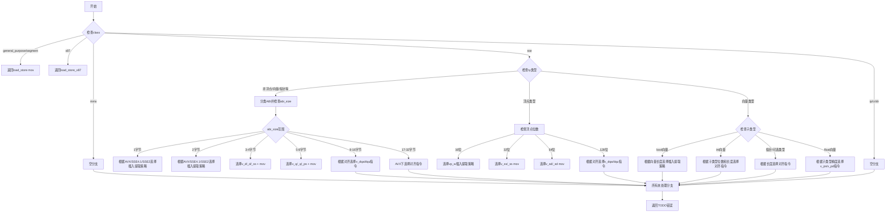

好的，我需要为给定的Zig函数`moveStrategy`绘制流程图。首先，我会通读代码，理解其结构和逻辑分支。这个函数根据不同的寄存器类别（class）和类型（ty）来决定移动策略（MoveStrategy）。

首先，函数接收四个参数：cg（CodeGen指针）、ty（Type）、class（Register.Class）和aligned（布尔值）。接下来，它根据不同的class进行分支处理：

1. **class为.general_purpose或.segment**：直接返回.load_store策略，使用mov指令。
2. **class为.x87**：返回.load_store_x87。
3. **class为.mmx**：暂时没有处理（空分支）。
4. **class为.sse**：根据ty的Zig类型标签进一步分支：
   - 对于非浮点类型，根据abi分类和大小选择不同的插入/提取或加载/存储策略。
   - 浮点类型根据位数（16、32、64、128位）选择不同的指令（如vp_w、v_ss、v_sd、v_dqa等）。
   - 向量类型根据子类型（bool、int、pointer、float等）及其长度进一步细分策略。
5. **其他class（.ip, .cr, .dr）**：暂时没有处理。
6. **如果所有情况都不匹配**：返回错误，提示“TODO moveStrategy for {}”。

接下来，我需要将这些逻辑分支转化为流程图。使用Mermaid的流程图语法，从函数入口开始，按条件分支逐步展开每个可能的路径。需要注意嵌套的switch语句，尤其是sse类别下的多层判断。同时，要处理不同条件下的返回路径，以及最后的默认错误返回。

需要确保每个条件分支都正确对应到流程图的节点，并且箭头指向正确的下一个节点或返回结果。对于复杂的嵌套结构，可能需要使用子图或分组来保持清晰。此外，由于代码中有多个switch和if-else链，需要仔细处理每个可能的条件，避免遗漏分支。

最后，检查流程图是否覆盖了所有代码路径，包括错误处理，并确保逻辑正确无误。
================================================
