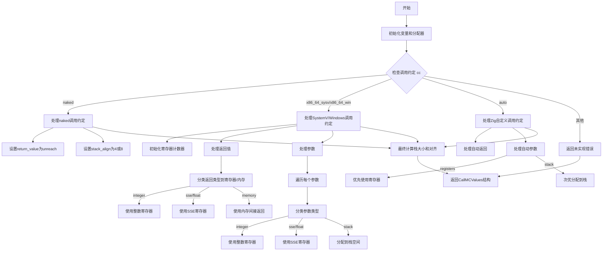

好的，我现在需要为给定的Zig函数绘制流程图。首先，我需要理解这个函数的功能和结构。这个函数名为resolveCallingConventionValues，属于x86_64架构的代码生成部分。它的主要职责是根据调用约定（Calling Convention）解析函数参数和返回值的MCValues（可能是指机器码值）。

首先，我会通读代码，了解大致流程：

1. 函数接收CodeGen指针、函数类型信息、可变参数类型列表和栈帧基址。
2. 初始化一些变量，包括分配器、参数类型数组等。
3. 根据调用约定（如naked、x86_64_sysv、x86_64_win、auto等）处理返回值和参数。
4. 对于不同的调用约定，处理寄存器分配、栈对齐、参数传递方式等。
5. 最后返回CallMCValues结构，包含参数、返回值、栈信息等。

接下来，我需要将这个过程分解成流程图中的各个步骤。流程图通常包括开始、判断、处理步骤、结束等节点。对于条件分支（如不同的调用约定），需要分支出不同的处理路径。

需要注意的是，代码中有多个switch语句，尤其是针对不同的调用约定（cc变量），每个case有不同的处理逻辑。例如，处理naked约定时直接设置返回值不可达，而处理x86_64_sysv或x86_64_win时则需要详细处理返回值和参数的寄存器分配及栈布局。

可能的步骤分解：

- 开始
- 初始化变量和分配器
- 检查调用约定（cc）
  - 如果是naked，处理简单情况
  - 如果是x86_64_sysv或x86_64_win，处理复杂参数和返回寄存器分配
  - 如果是auto，处理Zig自定义的调用约定
  - 其他情况返回错误
- 处理返回值
  - 根据返回类型是否为NoReturn或无运行时位设置不同的MCValue
  - 分类返回类型到不同的寄存器（整数、SSE、内存等）
- 处理参数
  - 遍历每个参数类型，分配到寄存器或栈上
  - 处理栈对齐和大小计算
- 计算栈的总大小和对齐
- 返回结果

在绘制流程图时，需要将这些步骤用适当的图形表示，并用箭头连接。例如，判断调用约定可以用菱形判断框，不同的处理分支用不同的流程线。

可能会遇到的问题包括如何正确表示嵌套的条件判断，例如在x86_64_sysv分支中还有对返回类型的分类处理，这可能需要进一步分解子流程。此外，处理参数时的循环结构也需要在流程图中体现。

最后，确保流程图清晰展示函数的主要逻辑路径，尤其是不同调用约定的处理差异，以及参数和返回值的分配过程。
================================================
