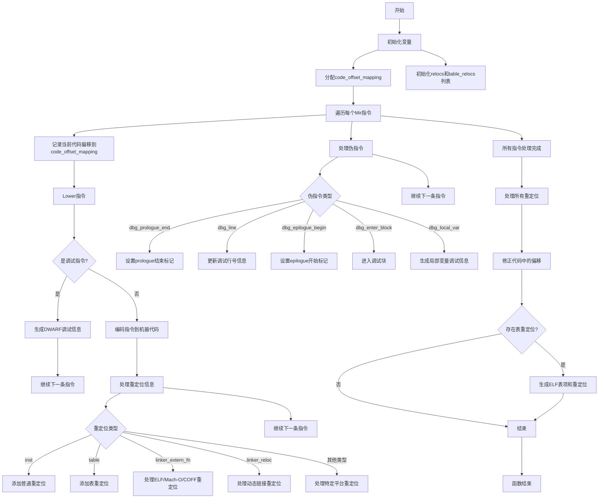

好的，我需要为给定的Zig函数`emitMir`绘制一个流程图。首先，我需要理解这个函数的结构和逻辑流程。让我先通读代码，了解各个部分的作用。

函数`emitMir`的主要任务似乎是处理中间表示（Mir）指令，生成机器代码，并处理相关的重定位信息。函数中包含了多个循环和条件判断，处理不同类型的指令和调试信息。

首先，函数开始处声明了一些变量，如`code_offset_mapping`、`relocs`和`table_relocs`。然后进入一个主循环，遍历所有的Mir指令。对于每个指令，处理可能的调试指令（如`.cfi_def_cfa`等），生成机器代码，并处理重定位信息。处理完所有指令后，处理重定位和表重定位，最后处理ELF文件相关的表信息。

接下来，我需要将这个过程分解成流程图中的各个步骤。主要的步骤包括：

1. 初始化变量（分配内存，初始化重定位列表）。
2. 遍历每个Mir指令：
   a. 记录代码偏移。
   b. 处理调试指令（如DWARF生成）。
   c. 编码指令到机器代码。
   d. 处理重定位信息（如ELF、Mach-O、COFF等不同格式）。
3. 处理伪指令（如调试信息、局部变量信息等）。
4. 处理所有重定位，修正代码中的偏移。
5. 处理表重定位（ELF特定处理）。

在绘制流程图时，需要注意条件分支，例如根据不同的调试输出类型（DWARF、Plan9、无）执行不同的操作，以及根据不同的二进制文件类型（ELF、Mach-O、COFF）处理不同的重定位方式。

可能需要将主循环内的步骤细化，特别是处理每个指令时的条件判断和不同情况的分支。同时，处理重定位的部分需要根据不同的目标文件格式进行分支处理。

最后，将所有这些步骤用Mermaid的流程图语法表示出来，确保逻辑清晰，步骤正确。
================================================
