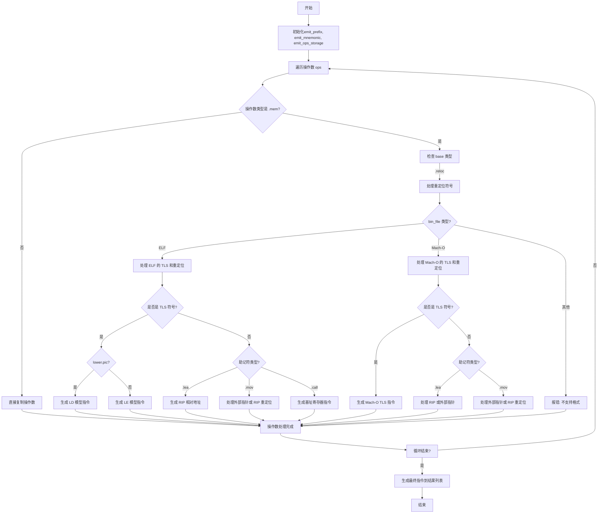

好的，我现在需要为给定的Zig函数`emit`绘制一个流程图。首先，我要理解这个函数的结构和逻辑。

函数`emit`接收一个`Lower`结构体指针、前缀、助记符和操作数数组。看起来它的主要作用是将指令生成到结果指令列表中，处理不同的二进制文件格式（如ELF和Mach-O），特别是处理内存操作数中的重定位和线程本地存储（TLS）。

首先，我需要分解函数的各个部分：

1. **初始化阶段**：复制前缀、助记符和操作数到局部变量，并为操作数分配存储空间。
2. **遍历操作数**：对于每个操作数，根据其类型进行处理，特别是处理`.mem`类型的操作数。
3. **处理内存操作数**：
   - 检查是否是重定位符号（`.reloc`）。
   - 根据不同的二进制文件格式（ELF或Mach-O）处理TLS和重定位。
   - 生成相应的指令（如`lea`, `mov`, `call`）并处理重定位。
4. **生成最终指令**：将处理后的前缀、助记符和操作数添加到结果指令列表中。

接下来，我需要识别所有的条件分支和循环：

- **循环**：`for (emit_ops, ops, 0..) |*emit_op, op, op_index| { ... }`遍历每个操作数。
- **条件判断**：
  - `switch (op)`处理操作数类型，特别是`.mem`。
  - 在`.mem`处理中，检查`base()`是否为`.reloc`。
  - 根据`lower.bin_file`的类型（ELF或Mach-O）分支处理。
  - 处理TLS时的条件判断（`lower.pic`是否为真）。
  - 根据不同的助记符（如`.lea`, `.mov`, `.call`）进行不同的处理。

对于流程图，需要将这些步骤和条件分支可视化。可能的节点包括：

- 开始节点：函数入口。
- 初始化变量。
- 循环开始：遍历操作数。
- 处理每个操作数的类型。
- 处理`.mem`和`.reloc`情况。
- 根据二进制文件类型分支到ELF或Mach-O处理。
- 处理TLS的不同模型（GD、LD、LE）。
- 生成相应的指令和重定位。
- 循环结束。
- 生成最终指令到结果列表。
- 结束节点：函数退出。

需要注意条件判断的嵌套，特别是多重`switch`和`if`语句。例如，处理ELF时的TLS逻辑包括多个条件判断，如是否使用PIC（位置无关代码），是否是外部符号等。

可能遇到的挑战是如何清晰地表达多层嵌套的条件和循环，同时保持流程图的可读性。可能需要使用子流程或分组来表示复杂的部分，如ELF和Mach-O的处理。

现在，我需要将这些逻辑步骤转化为Mermaid流程图语法，确保每个判断和操作都有对应的节点和箭头，并正确连接各个分支。
================================================
