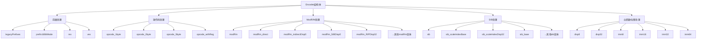

好的，我需要帮助用户将提供的 Zig 代码转换为 Mermaid 流程图。首先，我需要仔细阅读并理解这段代码的结构和各个部分的功能。

首先，这个文件定义了一个名为 `Encoder` 的函数，它接受两个编译时参数 `T` 和 `opts`，并返回一个结构体。这个结构体包含了一个 `writer` 字段，以及多个方法用于编码不同的 x86_64 指令前缀、操作码、ModR/M 字节、SIB 字节等。

接下来，我需要确定如何将这样的结构转换为流程图。因为这是一个结构体的方法集合，每个方法执行特定的编码任务，所以流程图可能需要展示这些方法的调用流程或它们之间的关系。

不过，用户要求的是“函数的流程图”，而这里的代码实际上是一个返回结构体类型的函数。因此，可能需要将整个 `Encoder` 函数的逻辑流程表示出来，或者展示结构体内部各方法的调用流程。

考虑到结构体的每个方法都是独立的，可能更适合为每个方法绘制一个子流程图，或者展示主函数如何构造结构体及其方法。但用户可能希望有一个整体的流程图，展示从创建 Encoder 实例到调用各个编码方法的过程。

例如：
1. 创建 Encoder 实例，传入 writer 和 options。
2. 调用各种前缀方法（如 legacyPrefixes, rex, vex）。
3. 编码操作码（opcode_1byte, opcode_2byte 等）。
4. 处理 ModR/M 和 SIB 字节。
5. 处理立即数和位移数据。

不过，由于这些方法之间没有明确的执行顺序，而是根据具体指令的需求调用不同的组合，流程图可能更侧重于展示各个方法的功能和它们之间的关系，而不是线性的执行流程。

或者，可以将每个方法作为一个节点，展示它们的输入输出，以及可能的调用顺序。但可能过于复杂。

可能需要进一步明确用户的需求。但根据提供的信息，可能最佳的方式是绘制一个高层次的结构图，展示 Encoder 结构体的主要组成部分和方法分类，如前缀处理、操作码处理、ModR/M、SIB、立即数处理等，并用箭头表示它们属于 Encoder 结构体的不同部分。

最后，将各部分用 Mermaid 语法表达出来，确保结构清晰，符合用户要求。
================================================
