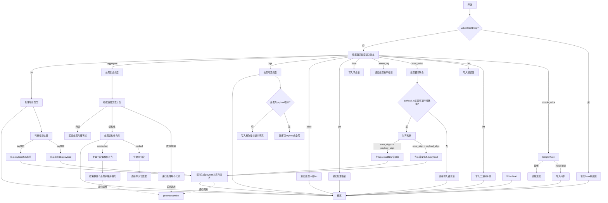

嗯，我需要为这个Zig函数`generateSymbol`画一个流程图。首先，我得仔细看看这个函数的结构和各个分支。函数的作用似乎是生成符号的二进制表示，处理各种不同的类型和值。

首先，函数开头有一些日志和错误处理，比如检查`val.isUndefDeep`，如果是的话就填充0xaa。然后是一个大的switch语句，根据`ip.indexToKey(val.toIntern())`的结果处理不同的类型。每个case对应不同的类型，比如.int_type、.ptr_type、.aggregate等等，每个类型有不同的处理逻辑。

我需要把这个流程分解成主要步骤。首先，函数开始，检查是否是Undef，如果是就填充0xaa。然后进入switch，处理各种类型。例如，处理整数类型时，写入二进制补码；处理错误联合类型时，处理错误值和有效载荷；处理结构体时，可能需要填充和对齐字段等等。

需要注意的是，有些case会递归调用`generateSymbol`，比如处理slice时分别处理ptr和len，处理aggregate时遍历元素并递归生成每个元素的符号。这可能导致流程图中有循环或递归的部分。

另外，处理联合类型（union）时，根据布局决定标签和有效载荷的顺序，以及填充。结构体的处理还分为packed和auto/extern布局，需要不同的处理步骤。

可能的结构是：

1. 开始
2. 检查是否是Undef，是的话填充0xaa并返回
3. 根据值的类型进入不同的处理分支
   - 简单值（如布尔值）直接写入0或1
   - 整型写入二进制补码
   - 错误联合处理错误值和有效载荷，考虑对齐和填充
   - 结构体处理每个字段，考虑对齐和填充
   - 联合处理标签和有效载荷的顺序，以及填充
   - 其他类型如指针、切片、可选类型等各自处理
4. 每个分支处理完后可能有填充或对齐操作
5. 结束

需要确保每个分支的关键步骤都被涵盖，递归调用的地方可能需要用子流程或者单独的部分表示。同时，错误处理和内存分配（如`code.appendNTimes`）也需要在流程中体现出来。

可能遇到的难点是如何简洁地表示复杂的类型处理和递归调用，同时保持流程图的可读性。可能需要将某些复杂部分分解成子流程，或者用注释说明关键步骤。
================================================

流程图关键说明：
1. **递归调用**：用虚线箭头表示对`generateSymbol`的递归调用
2. **核心分支**：
   - 处理`.error_union`时根据对齐规则决定写入顺序
   - 结构体分为 packed 和 auto/extern 两种布局方式
   - 联合类型根据标签对齐决定标签和 payload 的顺序
3. **特殊处理**：
   - 可选类型（`.opt`）根据是否用 payload 表示来区分逻辑
   - 浮点类型根据精度选择不同写入方式
   - 布尔值向量使用位操作直接修改字节
4. **内存操作**：
   - 对齐填充使用`appendNTimes`操作
   - 复合类型处理时计算字段偏移量