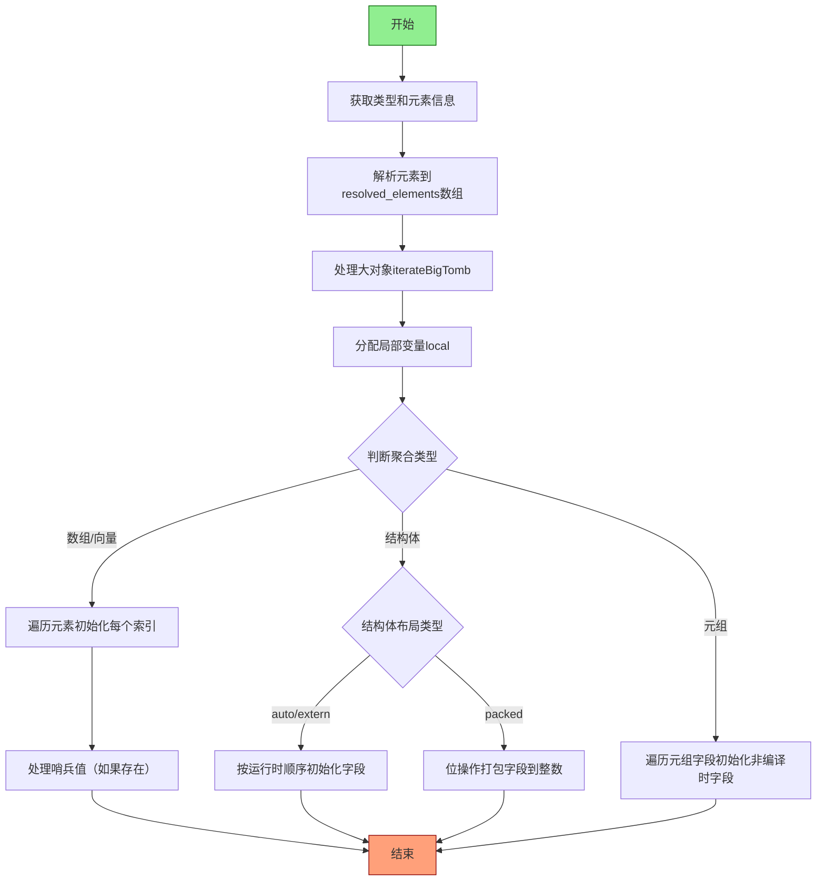

好的，我现在需要为给定的 Zig 函数 `airAggregateInit` 绘制一个流程图。首先，我需要理解这个函数的功能和结构。

函数的目标似乎是初始化一个聚合类型（如数组、结构体、向量或元组）的值。代码中处理了不同类型的聚合，包括数组、向量、结构体和元组，每种类型有不同的初始化逻辑。结构体还分为自动布局、外部布局和打包布局（packed）。

首先，我会通读代码，识别主要的步骤和条件分支：

1. **获取类型和元素信息**：从指令中提取类型信息，确定元素的数量和具体元素。
2. **解析元素**：为每个元素解析其值，存储到 `resolved_elements` 数组中。
3. **处理大对象**：使用 `iterateBigTomb` 处理可能的大对象，确保正确的内存管理。
4. **分配局部变量**：为聚合类型分配局部存储空间。
5. **根据聚合类型进行初始化**：
   - **数组或向量**：逐个初始化每个元素，处理可能的哨兵值（sentinel）。
   - **结构体**：
     - **自动或外部布局**：按字段顺序初始化每个字段。
     - **打包布局**：处理位操作，将字段按位打包到整数中。
   - **元组**：初始化每个非编译时确定的字段。

接下来，我需要将这些步骤转化为流程图的结构。流程图的开始是函数入口，然后分支处理不同类型的聚合。每个分支内部有各自的处理步骤。需要注意的是，结构体的处理有三个子分支，而数组/向量和元组相对直接。

可能的挑战是如何清晰地表达条件分支，尤其是结构体的不同布局处理。此外，处理打包结构体时的位操作逻辑较为复杂，可能需要简化的表示，避免流程图过于繁琐。

需要确认每个条件判断的位置，例如 `switch (ip.indexToKey(inst_ty.toIntern()))` 决定了处理哪种聚合类型，而结构体内部的 `switch (loaded_struct.layout)` 又分为三个子情况。

最后，确保流程图的逻辑顺序正确，每个步骤之间的连接准确，特别是错误处理和资源释放（如 `defer gpa.free(resolved_elements)`）是否在流程中体现。不过，由于流程图主要关注控制流，可能不需要详细的内存管理步骤，除非它们影响主要流程。

现在，将这些思考整理成一个结构化的流程图，使用 Mermaid 语法表示。
================================================

流程图说明：
1. 入口点开始后依次执行类型信息提取、元素解析和大对象处理
2. 分配局部变量后根据聚合类型分流：
   - 数组/向量：逐个初始化元素并处理可能的哨兵值
   - 结构体：根据布局类型分三个子流程（自动/外部布局直接初始化字段，打包布局使用位操作）
   - 元组：仅初始化运行时存在的字段
3. 所有分支最终汇聚到返回局部变量并结束流程
4. 颜色标记：绿色为开始节点，橙色为结束节点