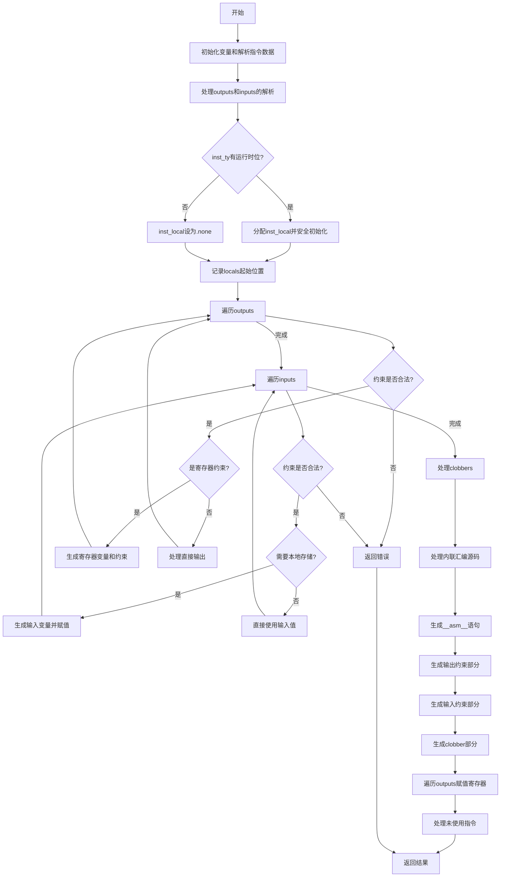

嗯，我需要为这个Zig函数`airAsm`绘制一个流程图。首先，我得仔细阅读代码，理解它的结构和逻辑流程。这个函数看起来像是处理内联汇编的代码生成部分，可能涉及解析指令、处理输入输出约束、生成对应的C代码等步骤。

首先，函数开头获取了一些指针和类型信息，比如`pt`、`zcu`、`ty_pl`。然后通过`extraData`获取了`Air.Asm`的数据。接着处理了`is_volatile`和`clobbers_len`，这可能涉及到标志位的解析。

接下来，代码处理了outputs和inputs的解析，通过`f.air.extra`数组切片来获取这些信息。这里可能需要考虑内存布局和如何正确解析这些额外数据。

然后进入一个大的代码块`result`，这里首先处理了`inst_ty`是否有运行时位，可能需要分配局部变量`inst_local`，并且在需要安全的情况下初始化为未定义值。

之后，处理outputs的循环，解析每个输出的约束条件和名称。这里可能会检查约束条件的格式，比如是否以`=`开头，或者是否被大括号包裹，如果不符合条件则返回错误。对于寄存器约束，生成相应的C代码，比如声明寄存器变量，并使用`__asm`绑定到特定寄存器。

接下来处理inputs的循环，同样解析约束条件和名称，可能需要为输入分配局部变量，并将输入值赋给这些局部变量，特别是当输入需要本地存储时（比如`asmInputNeedsLocal`判断为真）。

然后处理clobbers部分，遍历clobbers的数量，但看起来这部分只是跳过数据，没有实际生成代码？

之后处理内联汇编的源代码，进行一些格式调整，比如替换`%[name]`为C兼容的格式。这里用到了栈分配器来创建一个修正后的汇编字符串，然后写入到生成的C代码中。

接下来是生成实际的`__asm__`语句，包括volatile修饰符，输出、输入和clobbers的约束部分。这里可能需要遍历outputs和inputs再次，生成对应的约束表达式，引用之前分配的局部变量。

最后，处理outputs的赋值，将寄存器的值写回到对应的变量中，然后返回结果。

在整个过程中，可能还有错误处理，比如返回`f.fail`的情况，需要确保所有可能的错误路径都被覆盖。

现在，我需要将这个过程转化为流程图。流程图的步骤大致如下：

1. 函数开始，初始化变量，解析指令数据。
2. 处理outputs和inputs的解析，提取约束和名称。
3. 分配局部变量（如果需要），处理安全初始化。
4. 遍历outputs，生成寄存器变量和约束。
5. 遍历inputs，生成输入变量和约束。
6. 处理clobbers。
7. 处理内联汇编源代码，修正格式。
8. 生成`__asm__`语句，包括输出、输入、clobbers。
9. 处理outputs的赋值，将寄存器值写回。
10. 返回结果，处理未使用的指令。

需要注意循环和条件判断的分支，比如循环处理每个output和input，以及是否生成局部变量等条件。

可能还需要考虑错误处理的分支，比如约束不合法时直接返回错误。

最后，确保流程图的连贯性，每个步骤之间的转换正确，条件分支明确。
================================================

流程图说明：
1. **初始化阶段**：解析指令数据，提取outputs/inputs/clobbers信息
2. **类型处理**：根据类型决定是否分配局部变量
3. **输出约束处理**：
   - 检查约束合法性
   - 生成寄存器变量或直接处理输出
4. **输入约束处理**：
   - 检查约束合法性
   - 决定是否需要中间变量存储输入
5. **汇编模板处理**：
   - 转义特殊字符
   - 构造完整的__asm__语句
6. **后处理**：
   - 将寄存器值写回目标变量
   - 处理指令使用情况
   - 返回最终结果或错误

每个菱形节点表示条件判断，矩形节点表示操作步骤，箭头表示流程方向。红色分支为错误路径，绿色分支为正常执行路径。