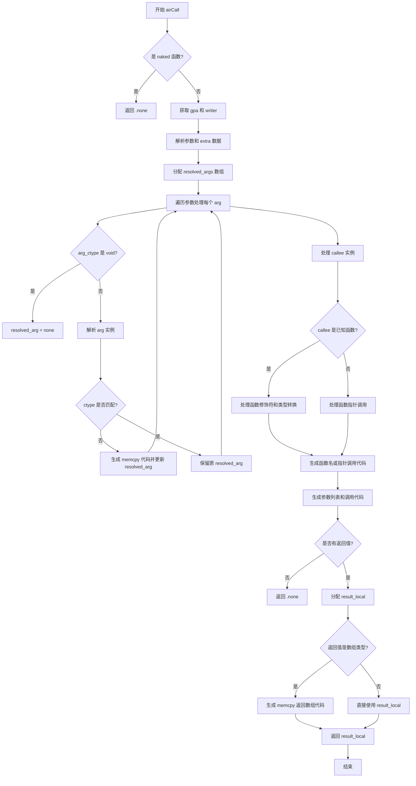

嗯，我现在需要理解用户提供的这个 Zig 函数 `airCall`，并画出它的流程图。首先，我应该通读代码，了解每个部分的功能。这个函数似乎处理函数调用相关的代码生成，可能属于编译器后端的一部分。函数参数包括 `Function` 指针、指令索引、调用修饰符，返回一个 `CValue` 或者错误。

首先，函数开始检查是否是 naked 函数，如果是的话直接返回 `.none`，因为 naked 函数不允许调用 panic。接下来，获取一些上下文变量，比如 `gpa`（通用指针分配器）和 `writer`（用于输出生成的 C 代码）。然后解析指令中的参数，获取调用的参数列表。

之后，分配内存给 `resolved_args`，遍历每个参数，处理它们的类型。如果参数类型是 `void`，则跳过；否则，解析参数实例，检查是否需要通过 `memcpy` 处理对齐或类型转换，生成相应的 C 代码。

接下来处理被调用函数（callee）的解析，判断是否是函数指针，获取返回类型，并根据返回类型处理结果存储。这里需要考虑不同的调用修饰符，如 `always_tail`、`never_tail` 等，处理不同的代码生成情况。

然后生成实际的函数调用代码，写入参数，处理返回值是否需要通过 `memcpy` 复制到数组中等情况。最后，释放临时分配的局部变量，返回结果。

画流程图时，需要将这些步骤分解成不同的节点，并用箭头表示流程走向。注意条件判断，如是否为 naked 函数、参数类型是否为 void、是否需要类型转换、不同的调用修饰符处理等。可能的分支点包括：

1. 检查是否为 naked 函数，直接返回。
2. 处理每个参数时的条件判断，是否需要使用 `memcpy`。
3. 处理 callee 的不同情况（已知函数、函数指针、需要类型转换等）。
4. 根据调用修饰符生成不同的调用代码。
5. 处理返回值的不同情况（void、未使用的结果、需要复制到数组等）。

需要确保每个条件分支都有对应的流程节点，并正确连接后续步骤。同时，注意错误处理，如 `try` 表达式可能引发的错误路径，但用户可能只需要主流程，暂时不考虑错误路径。

最后，使用 Mermaid 的流程图语法将这些步骤组织起来，用条件判断节点（菱形）和操作节点（矩形）表示，确保逻辑清晰，分支正确。
================================================
