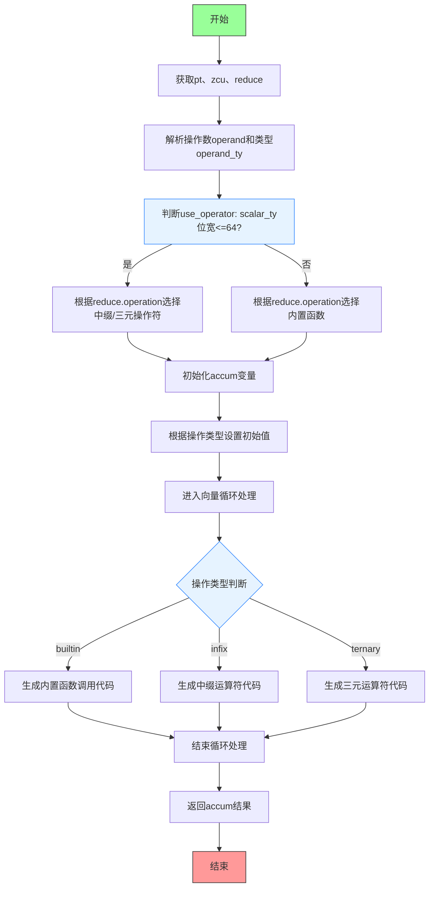

嗯，我需要为这个Zig函数`airReduce`画一个流程图。首先，我得理解这个函数的功能。看起来它是处理LLVM IR中的reduce指令，生成相应的C代码。函数开始部分处理了一些类型和操作数的解析，然后根据不同的reduce操作（如And、Or、Xor、Min、Max、Add、Mul）选择不同的代码生成策略。

首先，流程图应该有一个开始节点，然后逐步分解函数的各个步骤。函数首先获取一些类型信息，解析操作数，确定使用哪种操作符（内置函数、中缀运算符还是三元运算符）。接着初始化累加器，根据不同的操作设置初始值。然后进入循环处理向量的每个元素，应用相应的操作，最后返回累加器。

需要注意的是条件判断部分，比如`use_operator`的判断，以及根据不同的`reduce.operation`和类型选择不同的操作方式。这些条件分支在流程图中需要用判断节点表示。另外，循环处理向量元素的部分可能需要一个循环结构。

可能忽略的细节包括错误处理（比如`try`语句），但流程图主要关注主要逻辑流程。需要确保所有条件分支都被正确表示，并且步骤顺序正确。

现在，我需要将这些步骤转化为Mermaid的流程图语法，使用合适的节点和连接线，确保逻辑清晰。
================================================
