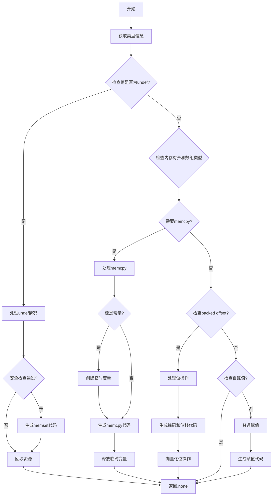

嗯，我需要为这个Zig函数`airStore`画一个流程图。首先，我得仔细读一遍代码，理解它的逻辑结构。这个函数看起来处理的是存储操作，可能涉及到指针和内存操作，比如memcpy或者直接赋值。

首先，函数开始的时候获取了一些类型信息，比如`ptr_ty`和`ptr_scalar_ty`，然后检查值是否是未定义的。如果值是未定义的（`val_is_undef`为真），并且满足某些安全条件，就会用memset填充内存。这时候需要生成对应的C代码，比如调用memset函数。

接下来，如果值不是未定义的，会检查内存对齐和是否是数组类型。如果需要对不齐或者数组类型，可能需要使用memcpy来复制内存。这里有一个条件判断`need_memcpy`，决定是否使用memcpy。如果是，就处理源值，可能需要创建临时变量，然后生成memcpy的代码。

如果不需要memcpy，但存在位偏移（packed offset）的情况，处理起来更复杂，涉及到位操作，比如与、或、移位等。这部分可能需要生成一些位运算的C代码，比如使用自定义的辅助函数如`zig_or_`和`zig_and_`。

最后，如果前面都不满足，就进行普通的赋值操作，生成相应的C代码。

流程图的节点应该包括这些主要的条件分支和处理步骤。比如开始节点，然后检查`val_is_undef`，分支出memset路径；否则检查`need_memcpy`，分支出memcpy路径；再检查是否有packed offset，分支出位操作路径；最后是普通赋值路径。每个分支结束后可能还有后续处理，比如释放临时变量或结束向量化操作。

需要注意错误处理和资源管理，比如`try`语句可能影响流程，但流程图主要关注正常流程。另外，像`reap`函数和`freeCValue`可能在流程中释放资源，但作为流程图可能不需要详细表示这些，除非它们影响主要分支。

最后，要确保各个条件判断和对应的处理步骤正确连接，形成完整的流程图结构。可能需要多次检查代码逻辑，确保所有分支都被覆盖，没有遗漏。
================================================

关键节点说明：
1. **安全检查分支**：当检测到未定义值时，会生成内存初始化代码
2. **内存对齐判断**：决定使用memcpy还是直接操作内存
3. **位偏移处理**：对非对齐的packed结构进行精细的位操作
4. **自赋值检查**：避免生成冗余的赋值代码
5. **向量化操作**：在整个流程中贯穿的向量化处理逻辑
6. **资源管理**：在多个分支中出现的临时变量回收逻辑