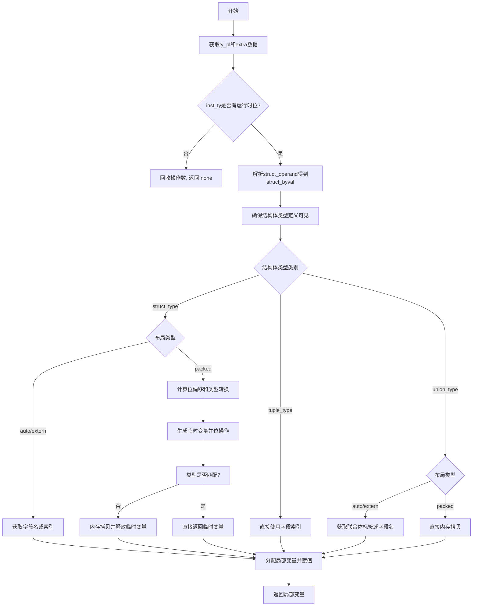

嗯，用户让我用Mermaid画一个函数的流程图，这个函数是用Zig写的，看起来是处理结构体字段值的生成的。首先，我需要理解这个函数的逻辑流程，然后才能转化为流程图。

首先，函数名是airStructFieldVal，属于代码生成部分，可能和LLVM的AIR（中间表示）有关。函数参数是Function指针和一个指令索引，返回CValue或者错误。函数的目标可能是根据AIR指令生成对应的C代码结构体字段访问。

接下来看代码结构：

1. 函数开始获取一些上下文信息，比如pt、zcu、ip，然后从指令中提取ty_pl和extra数据。extra包含结构体字段的信息，比如struct_operand和field_index。

2. 检查inst_ty是否有运行时位，如果没有，就直接返回.none，并回收操作数。

3. 如果有运行时位，解析struct_operand得到struct_byval，并回收该操作数。然后获取结构体类型struct_ty。

4. 确保结构体类型的完整定义可见，这里调用ctypeFromType生成C类型定义。

5. 根据结构体类型的不同情况处理字段名：
   - 如果是普通结构体（auto或extern布局），根据字段索引获取字段名。
   - 如果是packed布局，处理位偏移，生成位操作代码，可能涉及类型转换和临时变量的使用。
   - 如果是元组类型，直接使用字段索引。
   - 如果是联合体类型，根据布局处理标签或直接复制内存。

6. 对于packed结构体，需要处理位操作，可能生成临时变量，进行位移和类型转换，最后拷贝到目标变量。

7. 对于联合体，如果是packed布局，则直接拷贝内存。

8. 最后，分配局部变量，生成赋值语句，将结构体字段的值赋给局部变量，返回该局部变量。

现在需要将这些步骤转化为流程图。可能的流程分支包括：

- 是否有运行时位？ → 没有就直接返回。
- 结构体类型是struct、tuple还是union？
   - struct类型下，布局是auto/extern还是packed？
   - union类型下，布局是auto/extern还是packed？

每个分支处理不同的情况，生成不同的C代码。比如packed结构体需要处理位操作，而普通结构体直接访问字段名。

需要注意条件判断和循环结构，但在这个函数中主要是条件分支。可能用菱形判断框表示条件，矩形框表示操作，箭头连接流程。

可能需要将代码块分解为多个步骤，比如处理struct的不同布局，处理union的不同布局，以及最后的赋值操作。

现在需要将这些逻辑整理成Mermaid的流程图语法，确保每个分支正确连接，覆盖所有情况。
================================================
