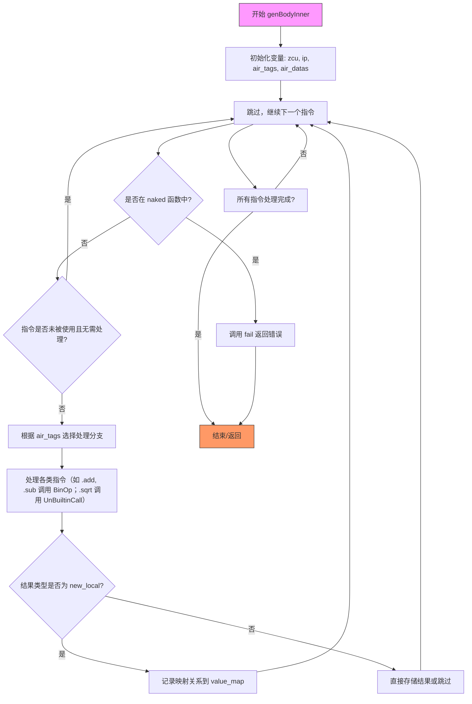

好的，我需要帮助用户理解如何为给定的Zig函数生成流程图。首先，我需要仔细阅读这段代码，了解它的结构和逻辑流程。

这个函数名为`genBodyInner`，看起来是用来生成某种中间表示或代码的函数体内部处理。函数参数包括一个指向`Function`的指针`f`和一个指令索引的切片`body`。返回类型是一个错误联合，可能处理分析失败或内存不足的情况。

接下来，函数内部首先获取了一些上下文变量，如`zcu`、`ip`、`air_tags`和`air_datas`。然后遍历`body`中的每个指令`inst`，进行一系列的条件检查和操作。

主要部分是一个大的switch语句，根据`air_tags`中的指令类型，调用不同的处理函数，如`airArg`、`airBreakpoint`等。每个case处理不同的指令类型，并可能返回不同的结果值。处理完成后，结果值会被存入`value_map`中，除非结果是`.none`则跳过。

需要注意循环中的几个关键点：
1. 检查是否在naked函数中不允许运行时代码。
2. 跳过未被使用的指令。
3. 处理各种指令类型，可能调用不同的辅助函数。
4. 处理结果值，更新`value_map`。

用户要求用Mermaid画出流程图，所以需要将代码逻辑分解成流程图的各个节点和分支。可能需要包括开始、循环遍历指令、条件检查、switch分支处理、结果处理等步骤。

可能的步骤：
1. 函数开始。
2. 初始化变量（zcu, ip等）。
3. 遍历body中的每个inst。
4. 检查是否在naked函数中，如果是则报错。
5. 检查指令是否未被使用，如果是则跳过。
6. 根据指令类型进入不同的处理分支（switch case）。
7. 处理后的结果存入value_map或跳过。
8. 循环结束，处理下一个指令。
9. 函数结束或返回错误。

需要确保所有条件分支都被覆盖，特别是错误处理和循环中的continue/return情况。同时，注意switch中的众多case可能需要简化为几个主要类别，避免流程图过于复杂。

最后，用Mermaid语法将这些步骤结构化，使用合适的节点和箭头连接，确保逻辑清晰。
================================================
