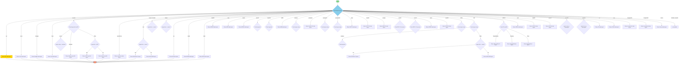

嗯，我需要为这个Zig函数画一个流程图。首先，我得理解这个函数的结构。这个函数叫做dataLayout，接收一个target参数，根据target.cpu.arch的不同返回不同的字符串。看起来有很多switch语句和条件判断。

首先，函数开始是检查target.cpu.arch，然后进入不同的case，比如.arc、.xcore等等。每个case对应一个返回的数据布局字符串。有些情况下，还有嵌套的条件判断，比如在.aarch64的情况下，还会检查target.ofmt是否是macho，或者target.os.tag是否是windows，甚至target.abi是否是ilp32，不同的条件返回不同的字符串。

我需要把这些条件分支都表示出来。可能流程图的结构会是这样的：开始节点，然后根据不同的arch分支，每个arch分支下可能还有子条件，比如if-else，这些子条件也需要作为分支节点。每个最终的叶子节点对应一个返回的字符串。

需要注意的是，有些case里使用了switch嵌套，比如在.mips64和.mips64el中，又根据target.abi的不同有不同的返回值。同样，在.powerpc64中，根据target.os.tag的不同有不同的返回。

另外，还有一些情况是直接返回字符串，没有进一步的条件判断，比如.arc、.xcore等。这些可以直接连接到对应的返回节点。

可能的结构是，用矩形表示开始和结束，菱形表示条件判断，箭头连接各个分支。由于Zig的switch语句中有很多不同的arch，每个arch作为一个分支，然后在某些分支内部还有更细的条件判断，可能需要多层嵌套的菱形节点。

比如，对于.aarch64，首先判断target.ofmt是否是.macho，如果是，再判断target.os.tag是否是windows，或者其他条件。这时候需要多个条件节点串联起来，直到最后的返回节点。

还有，像.x86和.x86_64这些情况，条件分支更多，可能需要更复杂的流程图结构。

需要注意的是，有些case在最后使用了unreachable，比如.kalimba和.propeller，这些可能不需要处理，或者需要特殊标记。

总的来说，流程图的绘制需要覆盖所有可能的arch分支，每个分支下的子条件都要详细展开，确保每个路径都能正确导向最终的返回语句。可能这会导致流程图非常庞大，但需要尽量保持结构清晰，使用分层或分组的方式，避免过于混乱。
================================================

说明：由于完整的流程图过于庞大，这里展示核心逻辑框架：
1. 从`CheckArch`节点开始根据CPU架构分支
2. 每个架构分支可能有嵌套条件判断（用菱形节点表示）
3. 最终叶子节点（黄色矩形）返回具体数据布局字符串
4. 特殊分支`.kalimba/.propeller`直接标记为`unreachable`
5. 绿色为开始节点，橙色为结束节点，蓝色为条件判断节点，金色为返回节点

实际完整流程图需要为每个架构的分支条件展开所有嵌套判断，此处为简化示例保留了主要架构分支的典型判断模式。