好的，我现在需要为这个用Zig编写的函数生成一个Mermaid流程图。首先，我需要仔细理解这个函数的结构和逻辑。这个函数名为initializeLLVMTarget，它接受一个std.Target.Cpu.Arch类型的参数arch，然后根据不同的arch值调用不同的LLVM初始化函数。

首先，我会注意到这是一个大型的switch语句，覆盖了多种不同的CPU架构。每个case对应一个或多个arch值，然后执行一系列LLVM初始化函数的调用。例如，当arch是.aarch64或.aarch64_be时，会调用五个不同的LLVM初始化函数。有些case，如.nvptx或.nvptx64，调用的函数数量不同，甚至有的函数可能不存在，如注释中提到的“没有LLVMInitializeNVPTXAsmParser函数”。

接下来，我需要确定如何将这些逻辑转换为流程图。流程图通常包括开始、判断、操作和结束节点。对于这个函数，流程大致如下：

1. 开始：函数开始。
2. 判断：根据arch的值进入不同的分支。
3. 操作：在每个分支中调用相应的LLVM初始化函数。
4. 结束：函数执行完毕，返回void。

需要注意的是，有些分支有额外的条件判断，比如检查build_options中的某些标志（例如llvm_has_xtensa）。这些条件也需要在流程图中体现出来。例如，在.xtensa分支中，只有当build_options.llvm_has_xtensa为真时，才会执行后续的初始化操作。

另外，有些case没有对应的操作，比如.spirv、.spirv32、.spirv64，以及.kalimba、.propeller，这些情况在流程图中需要表示出来，尤其是当遇到.kalimba或.propeller时，会触发unreachable，即程序不应该执行到这里，这在流程图中可能需要特殊标记。

在绘制流程图时，需要确保每个可能的arch值都有对应的处理路径。对于有多个arch值共享同一处理逻辑的情况（如.thumb, .thumbeb等），可以在同一个分支中合并处理。

可能的挑战是如何简洁地表示所有不同的分支，尤其是当存在多个arch值对应同一个处理块时。此外，条件判断（如build_options）需要正确嵌套在相应的分支中。

最后，确保流程图的正确性和可读性，可能需要使用子流程或分组来组织复杂的逻辑，避免图表过于庞大和混乱。
================================================

```mermaid
graph TD
    Start[开始] --> CheckArch{检查 arch 类型}
    
    CheckArch -->|aarch64/aarch64_be| AArch64[初始化AArch64目标]
    CheckArch -->|amdgcn| AMDGPU[初始化AMDGPU目标]
    CheckArch -->|thumb/thumbeb/arm/armeb| ARM[初始化ARM目标]
    CheckArch -->|avr| AVR[初始化AVR目标]
    CheckArch -->|bpfel/bpfeb| BPF[初始化BPF目标]
    CheckArch -->|hexagon| Hexagon[初始化Hexagon目标]
    CheckArch -->|lanai| Lanai[初始化Lanai目标]
    CheckArch -->|mips/mipsel/mips64/mips64el| MIPS[初始化MIPS目标]
    CheckArch -->|msp430| MSP430[初始化MSP430目标]
    CheckArch -->|nvptx/nvptx64| NVPTX[初始化NVPTX目标<br>（无AsmParser）]
    CheckArch -->|powerpc系列| PowerPC[初始化PowerPC目标]
    CheckArch -->|riscv32/riscv64| RISC-V[初始化RISC-V目标]
    CheckArch -->|sparc/sparc64| Sparc[初始化Sparc目标]
    CheckArch -->|s390x| SystemZ[初始化SystemZ目标]
    CheckArch -->|wasm32/wasm64| WebAssembly[初始化WebAssembly目标]
    CheckArch -->|x86/x86_64| X86[初始化X86目标]
    CheckArch -->|xtensa| Xtensa{检查llvm_has_xtensa}
    CheckArch -->|m68k| M68k{检查llvm_has_m68k}
    CheckArch -->|csky| CSKY{检查llvm_has_csky}
    CheckArch -->|ve| VE[初始化VE目标]
    CheckArch -->|arc| ARC{检查llvm_has_arc}
    CheckArch -->|loongarch32/loongarch64| LoongArch[初始化LoongArch目标]
    CheckArch -->|spirv系列| SPIRV[空操作]
    CheckArch -->|kalimba/propeller| Unreachable[触发unreachable错误]

    Xtensa -->|是| XtensaInit[初始化Xtensa目标<br>（无AsmPrinter）]
    Xtensa -->|否| SkipXtensa[跳过]
    
    M68k -->|是| M68kInit[初始化M68k目标]
    M68k -->|否| SkipM68k[跳过]
    
    CSKY -->|是| CSKYInit[初始化CSKY目标<br>（无AsmPrinter）]
    CSKY -->|否| SkipCSKY[跳过]
    
    ARC -->|是| ARCInit[初始化ARC目标<br>（无AsmParser）]
    ARC -->|否| SkipARC[跳过]

    subgraph 通用初始化流程
        AArch64 --> CallLLVM[调用5个LLVM初始化函数]
        AMDGPU --> CallLLVM
        ARM --> CallLLVM
        AVR --> CallLLVM
        BPF --> CallLLVM
        Hexagon --> CallLLVM
        Lanai --> CallLLVM
        MIPS --> CallLLVM
        MSP430 --> CallLLVM
        NVPTX --> CallLLVM_NVPTX[调用4个LLVM初始化函数]
        PowerPC --> CallLLVM
        RISC-V --> CallLLVM
        Sparc --> CallLLVM
        SystemZ --> CallLLVM
        WebAssembly --> CallLLVM
        X86 --> CallLLVM
        XtensaInit --> CallLLVM_Xtensa[调用3个初始化函数+AsmParser]
        M68kInit --> CallLLVM
        CSKYInit --> CallLLVM_CSKY[调用3个初始化函数+AsmParser]
        VE --> CallLLVM
        ARCInit --> CallLLVM_ARC[调用3个初始化函数+AsmPrinter]
        LoongArch --> CallLLVM
    end

    CallLLVM --> End[结束]
    CallLLVM_NVPTX --> End
    CallLLVM_Xtensa --> End
    CallLLVM_CSKY --> End
    CallLLVM_ARC --> End
    SPIRV --> End
    SkipXtensa --> End
    SkipM68k --> End
    SkipCSKY --> End
    SkipARC --> End
    Unreachable --> End[触发错误终止]
``` 

该流程图通过以下方式简化表示：
1. 将相同操作模式的架构合并到"通用初始化流程"子图中
2. 用条件判断节点处理需要检查编译选项的架构（如Xtensa/M68k等）
3. 对特殊情况进行标注（如缺少某些初始化函数）
4. 用"unreachable"明确标记不支持架构的处理逻辑
5. 保持主干路径清晰可见，同时将重复操作封装到子流程中