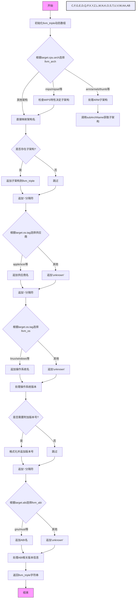

嗯，我现在需要为这个用 Zig 写的 `targetTriple` 函数画一个流程图。首先，我得仔细读一下代码，理解它的结构和各个部分的功能。这个函数的作用是生成一个 LLVM 目标三元组，根据传入的目标架构、操作系统和ABI等信息拼接字符串。

首先，函数开始的时候，初始化了一个动态数组 `llvm_triple` 用来构建最终的字符串。然后根据 `target.cpu.arch` 来匹配对应的 LLVM 架构名称。这里有很多不同的架构分支，比如 arm、aarch64、mips 等等。特别是 MIPS 的处理有些特别，会根据是否有某些特性（如 mips32r6）来决定具体的架构名称。

接下来处理子架构（sub_arch），比如对于 ARM 系列，根据不同的特性（如v7a、v8a等）来决定子架构名称。这部分用了一个辅助函数 `subArchName`，可能根据特性集查找对应的子架构字符串。其他如 powerpc、spirv 等架构也有自己的子架构处理。

然后是操作系统部分，根据 `target.os.tag` 来匹配对应的操作系统名称，比如 linux、windows、macosx 等。这里有一些特殊情况，比如 macOS 对应的 LLVM OS 是 "macosx"，而 iOS 是 "ios"。此外，还有一些版本号的处理，比如对于 Linux 或 Hurd，如果有版本信息的话，会附加版本号到三元组中。

最后处理 ABI 部分，根据 `target.abi` 来决定 ABI 字符串，如 gnu、musl、msvc 等。同样，某些情况下可能需要附加额外的版本信息，比如 Android 的版本号。

在流程图中，应该涵盖以下几个主要步骤：
1. 初始化动态数组。
2. 处理主架构（llvm_arch）。
3. 处理子架构（llvm_sub_arch）。
4. 添加供应商部分（如 apple、amd 等）。
5. 处理操作系统（llvm_os）及其版本。
6. 处理 ABI 及其可能的版本信息。
7. 返回最终构建的字符串。

需要注意条件分支，比如 switch 语句中的不同情况，以及可能的版本号附加逻辑。此外，错误处理（try 语句）也需要在流程中体现，比如如果某个步骤失败，整个函数会返回错误。

可能会有一些复杂的条件判断，比如处理 MIPS 架构时的特性检查，或者处理不同操作系统的版本信息。这些都需要在流程图中明确表示出来，确保逻辑清晰。

现在需要将这些步骤转化为 Mermaid 的流程图语法，确保每个判断和操作都正确对应，流程连贯，没有遗漏重要分支。例如，处理主架构时会有多个 case，每个 case 对应不同的字符串；处理子架构时可能为 null，需要判断是否添加；操作系统部分同样有多个可能的选项，每个对应不同的字符串；版本号的处理需要根据不同的情况附加不同的信息。

另外，需要注意代码中的 defer 语句，确保资源释放，但流程图可能不需要特别体现这一点，因为主要是逻辑流程而非资源管理。

最后，生成的三元组字符串需要返回，因此在流程图的末尾需要有一个结束节点，表示返回结果。
================================================
