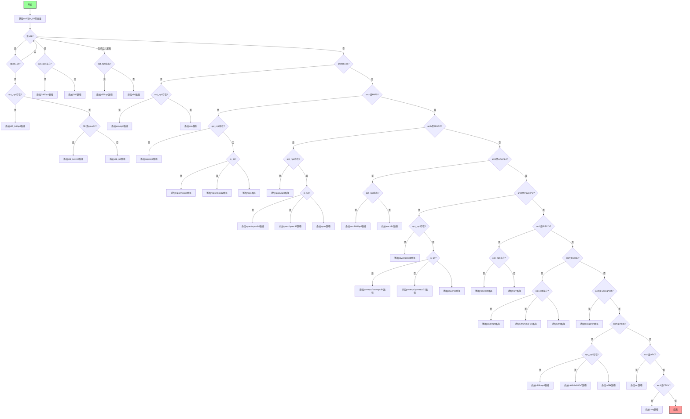

嗯，我现在需要帮用户用Mermaid画出一个Zig函数的流程图。这个函数叫做add_include_dirs_arch，看起来是用来根据不同的CPU架构添加包含目录到编译参数中的。首先，我需要理解这个函数的结构和逻辑流程。

首先，函数接收几个参数，包括Allocator、ArrayList args、target、opt_nptl、dir。然后根据target的CPU架构来决定添加哪些include路径。函数里面有很多条件判断，不同的架构有不同的处理逻辑。比如x86、Arm、MIPS等等，每个架构下可能还有子目录，比如64位和32位的区分，或者是否有NPTL的情况。

接下来，我需要理清楚每个条件分支的结构。比如，函数开始先获取arch，然后判断是否是x86、aarch64、ppc、sparc等。对于每个架构，又有进一步的判断，比如是否是64位，是否有opt_nptl参数存在。每个条件分支下，会构造不同的路径，并添加到args数组中。

需要注意的是，有些架构可能有多个条件分支，比如x86分为x86_64和x86，而x86_64下还有gnux32的ABI处理。此外，像MIPS、SPARC、PowerPC等架构在64位和32位的情况下路径不同，而且可能同时添加多个路径。例如，MIPS在非NPTL情况下，如果是64位，则添加mips/mips64，否则mips32，然后再添加mips目录本身。

然后，我需要将这些条件判断转化为流程图。流程图的开始应该是函数入口，然后依次检查各个架构的条件。每个条件分支下可能还有子条件，比如检查opt_nptl是否存在，以及是否是64位等。每个条件处理完后，都会添加相应的路径到args中。

需要注意的是，代码中有一些重复的结构。例如，对于每个架构，如果有opt_nptl，就添加包含nptl子目录的路径，否则根据是否是64位添加不同的子目录，然后添加主目录。此外，有些架构如LoongArch、ARC、CSKY等处理比较简单，直接添加主目录。

可能的挑战是确保所有条件分支都被正确覆盖，并且流程图的层次结构清晰，避免交叉线过多。可能需要使用子图或者分组来组织不同的架构分支，使流程图易于理解。

现在，我需要将上述逻辑转化为Mermaid的流程图语法。每个条件判断用菱形节点表示，处理步骤用矩形节点，箭头表示流程方向。需要注意的是，在Mermaid中，条件分支需要用条件判断节点，然后分出不同的路径。

例如，函数开始，然后检查是否是x86架构。如果是x86，再进一步检查是否是x86_64或x86。对于x86_64，再检查是否有opt_nptl，如果有，则添加对应的路径；否则处理gnux32的情况，并添加x86_64目录。接着，无论是否是x86_64或x86，如果有opt_nptl，还会添加x86/nptl目录，否则添加x86目录。这部分可能需要特别注意，因为代码中在x86分支后，还有另一个条件判断opt_nptl，导致可能添加两次不同的路径，这可能是一个错误或者需要特别说明的逻辑。

其他架构的处理相对直接，每个架构分支下处理对应的路径添加。例如，Arm架构下如果有opt_nptl则添加arm/nptl，否则添加arm目录。MIPS的情况更复杂，分为是否有opt_nptl，没有的话还要根据是否是64位添加不同的子目录，然后添加mips主目录。

在绘制流程图时，需要确保每个条件分支正确连接，并且处理步骤清晰。可能需要对每个架构使用不同的子图或分支结构，避免流程线混乱。同时，需要注意代码中的条件顺序，例如x86的处理在代码中是先处理x86_64和x86，然后还有一个额外的检查opt_nptl添加x86目录，这可能是一个独立的步骤，需要正确反映在流程图中。

总结步骤：
1. 函数开始。
2. 获取arch和is_64等变量。
3. 按顺序检查每个架构条件：
   - x86（进一步分为x86_64和x86）
   - Arm
   - MIPS
   - SPARC
   - AArch64
   - PowerPC
   - RISC-V
   - s390x
   - LoongArch
   - m68k
   - ARC
   - CSKY
4. 对于每个架构，根据opt_nptl和is_64添加相应的路径。
5. 结束。

现在，根据上述分析，编写Mermaid流程图。
================================================
