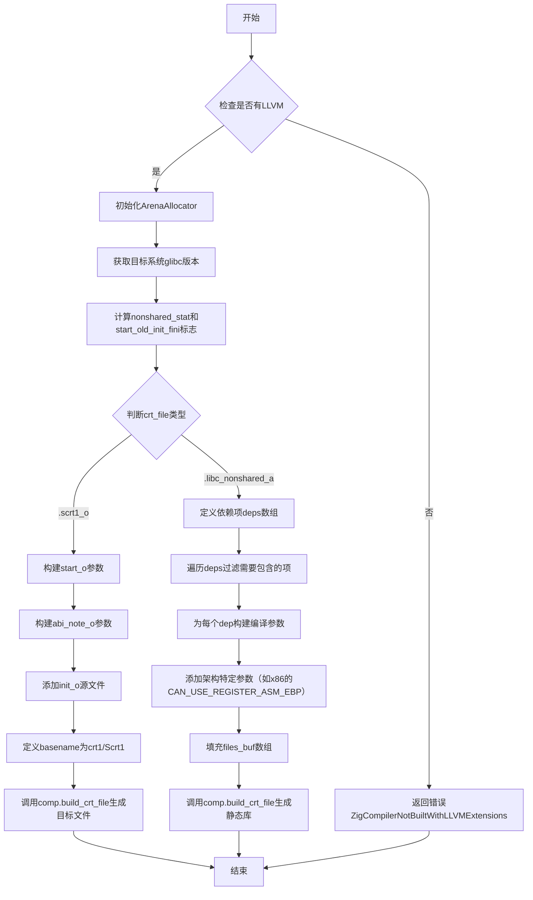

嗯，我现在需要帮用户用Mermaid画出他们提供的Zig函数buildCrtFile的流程图。首先，我得仔细看看这个函数的代码结构，了解它的逻辑流程。

这个函数首先检查是否启用了LLVM扩展，如果没有就返回错误。然后初始化了ArenaAllocator，获取目标系统的glibc版本，并设置了一些布尔变量：nonshared_stat和start_old_init_fini，这应该和版本比较有关。接下来，函数根据crt_file的不同分支处理不同的情况，分别是.scrt1_o和.libc_nonshared_a。

对于.scrt1_o的情况，构建了三个源文件：start_o、abi_note_o和init_o，并调用comp.build_crt_file生成目标文件。而对于.libc_nonshared_a，处理了一系列依赖项，遍历这些依赖项，过滤掉不需要包含的，然后为每个有效的dep构建参数，并最终生成库文件。

我需要把这些步骤分解成流程图中的各个节点。首先，函数入口，然后条件判断是否有LLVM。接着初始化内存分配器，获取目标版本，确定两个布尔值。然后根据crt_file的枚举值分支到不同的处理流程。每个分支内部有各自的处理步骤，比如添加参数、处理源文件等，最后调用build_crt_file。

需要注意的是，每个分支中的细节步骤较多，比如.scrt1_o中的三个CSourceFile的构建，每个可能有不同的参数添加。而.libc_nonshared_a分支需要遍历deps数组，过滤符合条件的项，并为每个生成对应的编译参数和文件。这些循环和条件判断在流程图中需要用相应的结构表示，比如循环节点和条件节点。

另外，函数中可能有一些错误处理和返回点，比如一开始的LLVM检查错误返回，但根据代码，主要流程是成功路径，所以可能不需要特别处理错误分支，除非用户特别需要。

现在，我需要将所有这些步骤组织成一个结构清晰的Mermaid流程图，正确反映函数的执行顺序和分支逻辑。可能需要使用子流程（subgraph）来区分不同的分支情况，确保每个分支内的步骤正确排列，并用箭头连接各个步骤。
================================================
