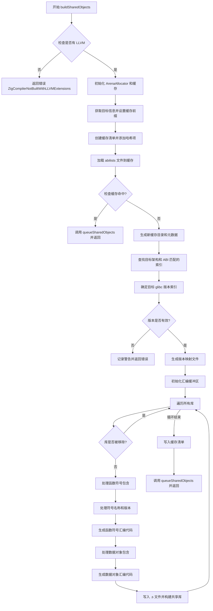

好的，我需要帮用户把提供的Zig函数`buildSharedObjects`转换成Mermaid流程图。首先，我会仔细阅读代码，理解它的结构和主要步骤。

函数开始检查是否有LLVM扩展，如果没有则返回错误。接着初始化一些分配器和目标信息，处理缓存目录和清单。然后加载元数据，查找匹配的目标和版本。接下来生成映射文件和处理符号版本，最后构建共享库并处理缓存清单。

我需要确定各个步骤之间的逻辑关系，包括条件判断和循环结构。例如，检查`have_llvm`、处理缓存命中、循环处理库和符号等。需要将这些步骤用Mermaid的语法表示出来，使用不同的形状表示开始、结束、判断、操作等。

在画流程图时，需要注意代码中的条件分支，比如`if (!build_options.have_llvm)`和缓存命中的处理。此外，循环处理库和符号的部分也需要用循环结构表示。可能还需要处理错误情况和一些子流程，如`queueSharedObjects`和`buildSharedLib`。

需要确保流程图的逻辑清晰，步骤完整，并正确反映代码的执行流程。可能需要对复杂的部分进行简化，但关键步骤和判断必须保留。
================================================

关键节点说明：
1. 包含重要条件判断（菱形节点）
2. 循环处理库和符号采用子流程表示
3. 错误处理和缓存机制完整呈现
4. 最终输出路径与初始缓存检查形成闭环
5. 符号版本处理和汇编代码生成作为核心操作突出显示