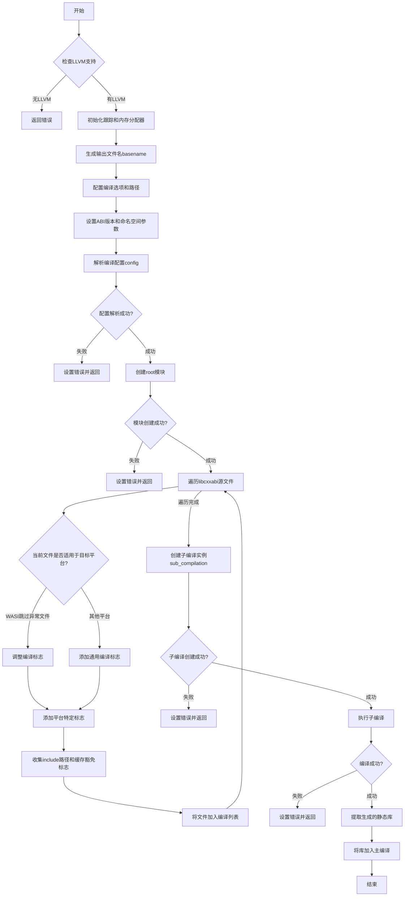

嗯，我现在需要为这个Zig函数`buildLibCxxAbi`画一个流程图。首先，我得仔细阅读代码，理解每个步骤的作用。函数的主要目的是构建libc++abi库，所以流程应该从检查LLVM支持开始，然后处理各种配置，编译源文件，最后生成静态库。

首先，函数一开始检查是否有LLVM支持，如果没有就返回错误。接着初始化一些跟踪和内存分配器。然后生成输出文件名，配置编译选项，包括目标平台、优化模式等。之后，处理各种include路径和宏定义，比如abi版本和命名空间。

接下来，创建模块和配置，收集所有的C源文件，并为每个源文件设置编译标志，比如针对WASI平台的特殊处理，多线程支持等。然后创建子编译实例，配置编译参数，执行编译，最后处理输出，将生成的静态库添加到编译中。

在这个过程中，需要注意错误处理，比如在创建模块或子编译失败时，设置错误信息并返回。同时，不同的平台（如WASI、Windows、Musl等）会有不同的编译选项，这些分支也需要在流程图中体现。

可能需要将整个流程分为几个主要部分：初始化检查、配置设置、模块创建、源文件处理、子编译执行、结果处理。每个部分中的步骤需要按顺序排列，并根据条件分支画出不同的路径，比如是否支持LLVM、目标平台是否为WASI等。

另外，函数中有很多条件判断，比如针对不同操作系统或ABI的编译选项调整，这些条件需要在流程图中用菱形判断框表示，分出不同的处理流程。例如，当目标平台是WASI时，跳过某些源文件或添加特定的编译标志。

最后，确保流程图的结束点正确，无论是成功生成静态库还是中途遇到错误返回。
================================================

流程图说明：
1. 从初始化检查开始，关键路径用绿色表示，错误路径用红色表示
2. 主要逻辑分支：
   - LLVM支持检查
   - 配置解析结果
   - 模块创建结果
   - 平台相关编译标志调整
   - 子编译过程状态
3. 核心处理流程包含：
   - 路径配置
   - 宏定义处理
   - 源文件过滤和标志设置
   - 多平台适配逻辑
   - 编译实例的级联执行
4. 最终输出静态库并集成到主编译系统中