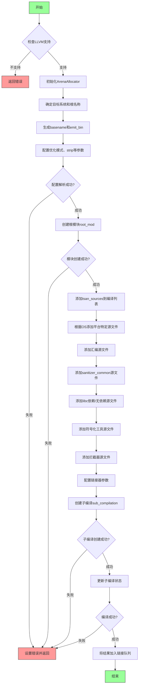

嗯，我需要画出这个Zig函数的流程图。首先，我得仔细阅读代码，理解每个步骤的作用。这个函数叫做buildTsan，看起来是用来构建线程消毒器（ThreadSanitizer）的。

首先，函数一开始检查是否启用了LLVM扩展，如果没有，就返回错误。接下来，用trace跟踪函数执行，并在结束时释放。然后创建一个ArenaAllocator，用于内存管理，之后释放它。

接下来，根据目标操作系统选择不同的根名称（root_name）和链接模式（link_mode）。然后生成基本名称（basename），确定输出位置（emit_bin）。之后处理优化模式、strip设置、展开表（unwind_tables）等配置。

然后，解析配置（config），如果失败则设置错误。接着创建根模块（root_mod），处理可能的错误。然后添加各种源文件到c_source_files列表中，根据不同的操作系统和架构选择不同的源文件，并设置编译标志（cflags）。

之后处理sanitizer_common、interception等部分的源文件，继续添加编译标志。接着设置链接器相关的参数，如skip_linker_dependencies、linker_allow_shlib_undefined等。

然后创建子编译（sub_compilation），处理可能的错误，最后更新子编译，处理结果，并将生成的crt_file加入链接任务队列。

现在，我需要将这些步骤转化为流程图。流程图应该包括开始、条件判断、处理步骤、错误处理、结束等部分。需要注意的是各个条件分支，比如目标操作系统的不同处理，错误路径等。

可能需要分块处理：初始化配置、源文件处理、编译设置、子编译执行、结果处理。每个块中的步骤按顺序排列，错误处理分支指向错误返回点。

同时，要注意循环结构，比如遍历tsan_sources、platform_tsan_sources等部分，可能需要用循环节点表示，但流程图通常不详细显示循环内部，而是用处理块概括。

最后，确保流程图的连贯性，正确反映函数执行路径。
================================================
