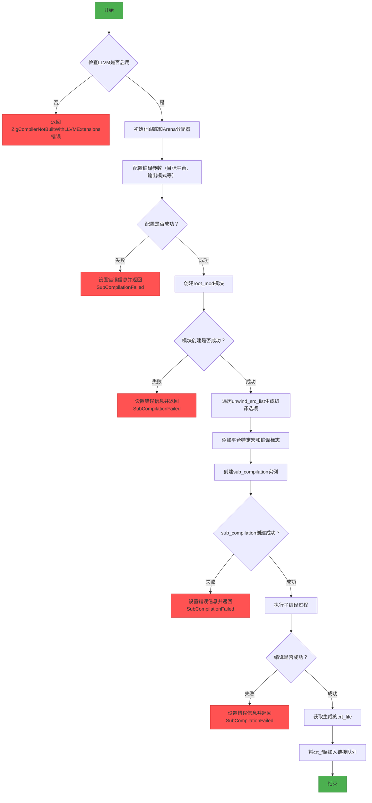

嗯，我现在需要帮用户用Mermaid画出他们提供的Zig函数的流程图。首先，我得仔细看看这个函数是做什么的。函数名是buildStaticLib，看起来是用于构建一个静态库，可能是libunwind。接下来我需要理解这个函数的结构和各个步骤。

首先，函数一开始检查是否启用了LLVM扩展，如果没有就直接返回错误。然后初始化了一些跟踪和内存分配的东西，比如arena_allocator。接着设置了一些编译配置，比如目标平台、输出模式等。这部分可能有条件判断，比如针对不同的操作系统和架构设置不同的unwind_tables。

然后创建了一个root_mod模块，这里可能会有错误处理，如果创建失败的话会设置错误信息并返回。接着处理了一些源文件，遍历unwind_src_list，为每个源文件生成编译选项，根据文件类型添加不同的编译标志。这里有很多条件判断，比如根据目标平台的架构添加特定宏定义，或者根据是否调试模式添加调试标志。

之后创建了一个sub_compilation，进行实际的编译过程。如果创建失败，同样需要处理错误。最后，处理编译结果，将生成的静态库文件添加到链接任务队列中。

我需要把这些步骤分解成流程图中的各个节点。需要考虑条件判断的分支，比如是否有LLVM、不同目标平台的处理、模块创建是否成功、编译是否成功等。每个错误处理路径都要表示出来，可能用菱形判断框，然后根据结果走向不同的流程。

可能会有重复的部分，比如处理每个源文件的循环，这在流程图中可能需要用循环结构表示，但Mermaid可能不太方便直接表示循环，可能需要简化成一个处理所有源文件的步骤。或者用子流程的方式，但用户可能希望简化。

另外，函数中有很多错误处理，每个步骤如果出错，都会设置错误信息并返回SubCompilationFailed。这些错误路径需要在流程图中体现出来，比如每个主要步骤后都有成功和失败的分支。

我需要确保流程图的逻辑正确，覆盖函数的主要步骤和错误处理。可能的结构是：

开始 -> 检查LLVM -> 失败返回错误
       -> 成功则初始化跟踪和arena
       -> 配置编译参数 -> 失败处理
       -> 创建root模块 -> 失败处理
       -> 处理所有源文件的编译选项
       -> 创建sub_compilation -> 失败处理
       -> 执行编译 -> 失败处理
       -> 处理结果，链接库
       -> 结束

每个错误处理节点都会设置错误信息并返回SubCompilationFailed。需要将这些判断和分支都画出来。可能用菱形判断节点，然后根据条件走不同的路径。

可能还需要注意一些细节，比如在配置阶段有多个条件判断，如unwind_tables的设置，是否Windows x86等，这些是否需要在流程图中体现？或者是否简化，因为用户可能希望主要流程而非每个条件。

用户提供的代码中有很多细节，但流程图需要简化，抓住主要步骤。可能需要将处理每个源文件的循环简化为一个步骤，比如“生成每个源文件的编译选项”。

最终，我需要用Mermaid语法将这些步骤组织起来，使用合适的节点和箭头，正确表示函数执行的流程。
================================================
