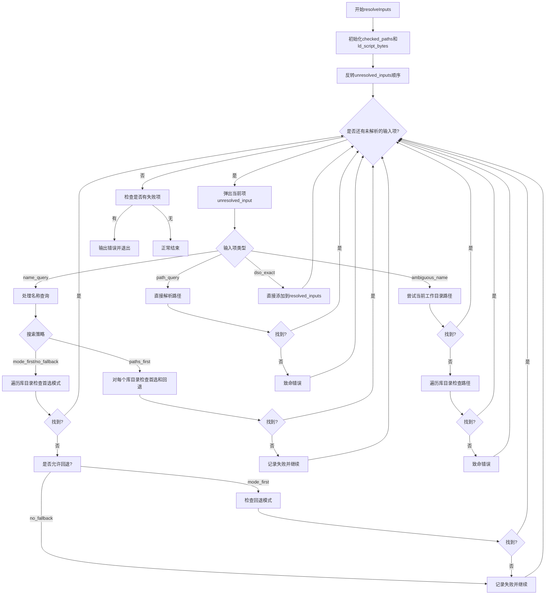

嗯，我需要为提供的Zig函数`resolveInputs`画一个流程图。首先，我需要仔细阅读代码，理解它的结构和逻辑流程。这个函数的主要作用似乎是解析输入，处理各种类型的未解析输入，比如名称查询、路径查询等，并将它们转换为已解析的输入。

首先，函数开始初始化一些变量，比如`checked_paths`和`ld_script_bytes`，并在结束时释放它们的资源。然后，有一个循环处理`unresolved_inputs`，使用`mem.reverse`反转输入项的顺序，这可能是因为要处理外部系统库的依赖关系。

接下来是主要的循环`syslib: while (unresolved_inputs.pop()) |unresolved_input|`，这里会根据不同的未解析输入类型进行处理。每个分支处理不同类型的输入，比如`.name_query`、`.ambiguous_name`、`.path_query`和`.dso_exact`。对于每个分支，可能有不同的处理逻辑，比如检查库目录、处理路径输入等。

在处理`.name_query`时，根据搜索策略（`mode_first`、`no_fallback`、`paths_first`）的不同，会有不同的搜索路径和模式检查。例如，对于`mode_first`，首先检查首选模式，如果失败则检查回退模式。而`paths_first`则会对每个库目录分别检查首选和回退模式。

在处理`.ambiguous_name`时，首先检查当前工作目录下的路径，如果未找到，则检查库目录。对于`.path_query`，直接解析路径输入。`.dso_exact`则直接添加到已解析的输入中。

最后，如果有任何失败的库，会输出错误信息并退出进程。

在绘制流程图时，需要考虑所有这些分支和循环结构。可能需要从函数入口开始，逐步绘制每个步骤的判断和处理流程，包括循环、条件分支以及错误处理。同时，要注意处理不同输入类型时的不同逻辑路径，以及可能的递归或嵌套处理（例如在解析库输入时可能再次向`unresolved_inputs`添加新的项）。

需要确保流程图清晰展示各个判断点和处理流程，尤其是不同搜索策略和输入类型的分支。此外，错误处理和资源释放的部分也需要在流程图中体现出来。
================================================

流程说明：
1. 函数初始化并反转输入队列
2. 循环处理每个未解析输入项
3. 根据输入类型分四种处理分支：
   - 名称查询（根据搜索策略分三种模式处理）
   - 模糊名称（先检查CWD路径，再检查库目录）
   - 路径查询（直接解析）
   - 精确DSO（直接添加）
4. 处理失败时记录错误信息
5. 最终检查失败列表，有错误则报错退出
6. 所有输入处理完成后正常结束

各分支通过不同颜色区分的判断逻辑，最终统一回到主循环继续处理下一个输入项。