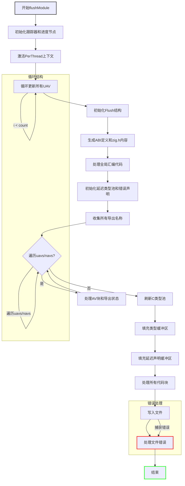

嗯，用户让我用Mermaid画一个Zig函数的流程图。首先，我需要仔细看一下这个函数的结构。这个函数名为flushModule，属于C模块的一部分，看起来是用于将模块内容写入文件的。

首先，我要理清函数的执行步骤。函数一开始有一些初始化操作，比如获取跟踪器、子进度节点，以及激活PerThread上下文。然后进入一个循环，更新UAVs（可能是某种抽象的数据结构）。接下来处理ABI定义和生成zig.h的内容。然后处理全局汇编代码，生成并添加到缓冲区。

之后，处理延迟的类型声明和错误声明。这里涉及到CType池的管理，包括初始化和刷新。然后处理导出名称，遍历不同的导出结构（uavs和navs），分别处理它们的AV块。

在处理完所有声明后，将类型信息和延迟声明的内容填充到缓冲区中。最后，将所有缓冲区的内容写入文件，处理可能的错误。

接下来，我需要将这些步骤转化为流程图。流程图应该从函数入口开始，按顺序展示各个主要步骤，包括循环、条件判断和错误处理。需要注意函数中的循环结构，比如更新UAV的循环和遍历uavs/navs的循环。同时，处理导出名称的部分可能需要一个条件判断，以区分不同的导出情况。

还需要注意函数中的错误处理，比如使用try关键字的地方，可能需要在流程图中表示错误路径。不过，根据用户提供的代码，错误处理主要是通过返回错误或调用diags.fail，可能在流程图中以结束节点表示。

最后，确保流程图的每个步骤都对应代码中的一个关键操作，结构清晰，层次分明。可能还需要将一些复杂的子步骤合并为单个节点，以保持流程图的简洁性。
================================================
