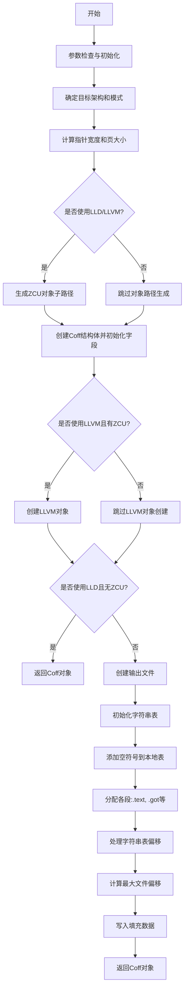

好的，我需要为提供的Zig代码中的`createEmpty`函数绘制一个流程图。首先，我需要理解这个函数的结构和逻辑流程。

首先，函数接收几个参数，包括分配器、编译信息、输出路径和选项。然后，它进行了一系列的断言和变量初始化，比如获取目标架构的信息，确定指针宽度和页大小。接下来，处理与LLVM和LLD相关的路径设置，创建Coff结构体并初始化其各个字段。之后，根据不同的条件（如是否使用LLVM或LLD）进行分支处理，比如创建文件、分配各个节（如.text、.got、.rdata等），最后处理字符串表和其他段的位置。

我需要将这些步骤分解为流程图中的各个节点，并确定它们之间的逻辑顺序和条件分支。需要注意的是条件判断部分，比如`if (use_llvm and comp.config.have_zcu)`和`if (use_lld and (use_llvm or !comp.config.have_zcu))`等，这些会导致不同的执行路径。此外，错误处理（如`errdefer`）也需要在流程图中体现吗？可能需要，但用户可能更关注主要流程。

还需要注意循环和迭代的部分，比如最后的循环计算最大文件偏移量。不过这部分可能是一个简单的循环，可以在流程图中用“循环处理每个段头”来表示。

在绘制流程图时，要确保每个步骤都清晰，并且条件分支明确。可能需要将代码块分解为更小的步骤，比如变量初始化、结构体初始化、条件检查、文件创建、段分配等。

最后，需要确保流程图的正确性和完整性，覆盖所有主要执行路径，并正确反映代码的逻辑结构。
================================================

该流程图展示了以下关键步骤：
1. 参数检查与目标架构初始化
2. 路径生成条件判断
3. Coff结构体核心初始化
4. LLVM相关处理分支
5. 文件创建与段分配流程
6. 字符串表与偏移计算
7. 最终文件空间处理
8. 返回构造完成的Coff对象

主要条件分支包括：
- 是否使用LLD/LLVM决定对象路径生成
- LLVM和ZCU的条件判断
- LLD链接器的提前返回分支

每个矩形框表示一个操作步骤，菱形框表示条件判断，箭头表示流程方向。