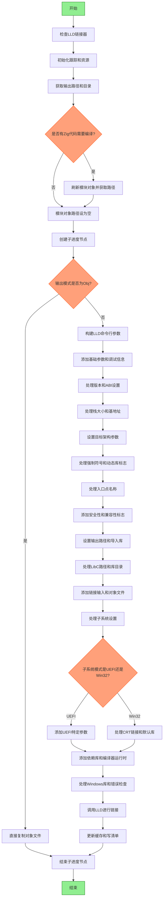

好的，我需要根据提供的Zig代码画出函数的流程图。首先，我需要理解这个函数的功能。看起来这是一个使用LLD链接器进行COFF文件链接的函数。函数名是linkWithLLD，接受多个参数，包括Coff结构体指针、分配器、线程ID和进度节点。

首先，我会通读代码，确定主要的步骤和分支。比如，函数开始时进行一些检查，处理输出路径，处理模块对象路径，然后根据配置决定是否调用LLD进行链接。如果输出模式是Obj，就直接复制文件；否则构造LLD的命令行参数并执行。

接下来，我需要确定流程中的各个判断点和循环。例如，是否禁用LLD缓存，是否处理动态库，如何处理不同的目标架构，子系统设置等。这些判断会导致不同的执行路径。

然后，考虑异常处理和错误返回。函数中有多个try和catch，需要画出可能的错误分支。例如，处理缓存时的错误，文件操作失败等。

还需要注意函数中的循环结构，比如遍历链接输入、库目录、Windows库等。这些循环需要体现在流程图中。

可能还需要考虑子流程，例如调用spawnLld函数，这部分可能需要简化为一个步骤，或者进一步分解。

最后，将所有步骤和分支用mermaid的流程图语法表示出来，确保逻辑正确，步骤清晰。
================================================
