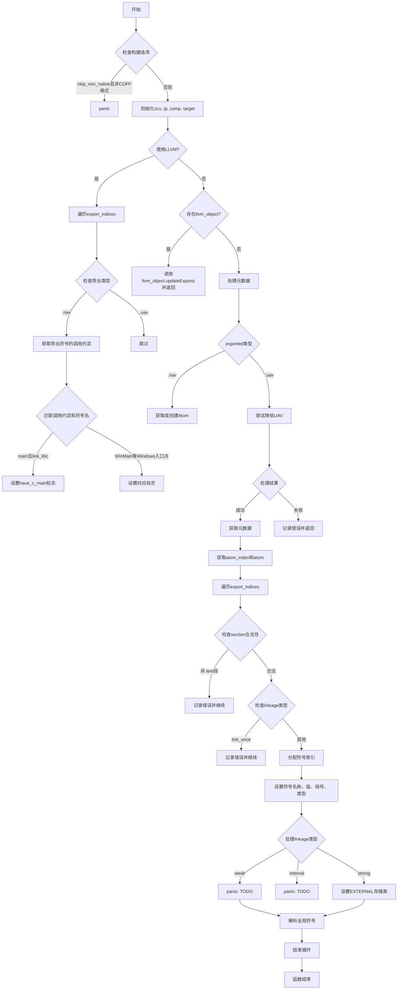

好的，我需要为提供的Zig函数`updateExports`绘制一个流程图。首先，我需要理解这个函数的结构和逻辑流程。

首先，函数开始时检查构建选项，如果不符合条件则panic。接下来，它处理与LLVM相关的逻辑，遍历导出索引，根据不同的条件设置标志。然后，如果存在`llvm_object`，则调用其`updateExports`方法并返回。

如果未使用LLVM对象，函数继续处理元数据，根据`exported`的类型（`.nav`或`.uav`）获取或创建元数据。对于`.uav`类型，它尝试降低UAV并处理可能的失败情况。

之后，获取原子索引和原子，然后遍历所有导出索引。对于每个导出索引，检查段名称是否合法，处理链接类型，分配符号索引，设置符号属性，并解析全局符号。

在绘制流程图时，需要注意各个条件分支和循环结构，比如`for (export_indices)`循环内的处理步骤。同时，需要处理错误情况，如`try zcu.failed_exports.putNoClobber`等错误处理路径。

可能需要使用不同的形状来表示不同的流程步骤，如矩形表示处理步骤，菱形表示条件判断，平行四边形表示输入/输出，圆形表示连接点等。此外，需要确保循环和条件分支正确连接，逻辑清晰。

最后，确认流程图的正确性，确保所有可能的执行路径都被覆盖，特别是错误处理路径和条件分支。
================================================
