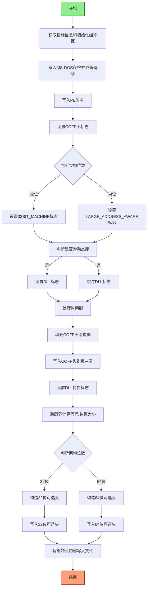

嗯，我现在需要帮用户把提供的Zig代码中的`writeHeader`函数用Mermaid流程图画出来。首先，我需要理解这个函数的功能。看起来这个函数是用于生成COFF文件的头部结构，包括DOS存根、PE头、可选头等部分。

首先，函数开始的时候，获取了目标机器的信息，初始化了一个缓冲区用于写入头部数据。然后写入了MS-DOS存根，并更新了指向PE头的偏移量。接下来写入PE签名，设置COFF头的各种标志，比如是否是可执行文件、是否剥离调试信息等，根据指针宽度（32位或64位）设置不同的标志。如果是动态链接库的话，还要设置DLL标志。

然后处理时间戳，生成COFF头结构体，包括机器类型、节的数量、时间戳、符号表位置、可选头的大小等。接着根据32位或64位架构的不同，分别构造不同的可选头结构，包括各种大小、入口点地址、段的对齐方式、子系统版本等。最后将生成的头部数据写入到文件的起始位置。

接下来，我需要把这些步骤转化为流程图。流程图通常包括开始、各个处理步骤、判断分支、结束等部分。这里有几个关键的分支，比如32位和64位的处理，以及是否是动态链接库的判断。需要确保流程图的每个步骤都清晰，分支正确。

需要注意的是，代码中有一些条件判断，比如`coff.ptr_width`的不同处理，以及`coff.base.comp.config.output_mode`是否为动态库的判断。这些在流程图中应该用菱形判断框来表示分支。同时，循环部分（比如遍历sections计算size_of_code等）可能需要用循环结构表示，不过由于代码中是使用for循环，可以在流程图中简化为一个处理步骤，说明循环处理每个section。

另外，错误处理部分这里用了Zig的错误联合类型，但代码中大部分是`catch unreachable`，可能表示这些写入操作不会失败，或者在错误时直接崩溃。所以在流程图中可能不需要特别处理错误路径。

最后，需要确认流程图的开始和结束点，以及各步骤的顺序是否正确。可能还需要将一些细节合并，避免流程图过于复杂。比如，将多个写操作合并为一个步骤，或者在设置flags时作为一个整体步骤。

现在，我需要根据这些分析，用Mermaid语法构建流程图，确保结构正确，步骤清晰，分支处理得当。
================================================
