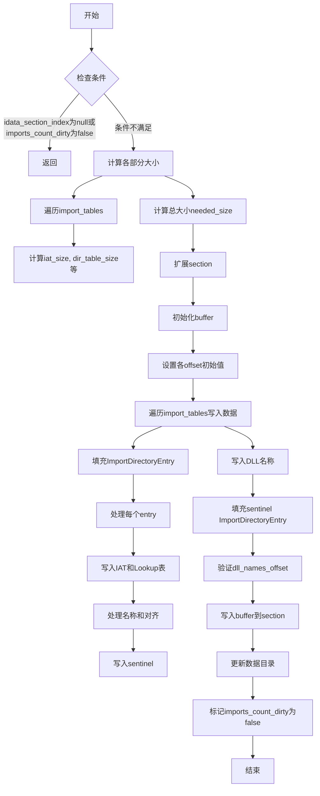

嗯，我需要用Mermaid来画这个函数的流程图。首先，我得先理解这个函数的结构和逻辑。这个函数的名字是writeImportTables，看起来是处理COFF文件的导入表相关的内容。

首先，函数一开始检查coff.idata_section_index是否为null，如果是的话就直接返回。然后检查imports_count_dirty是否为false，如果是的话也返回。这两个条件应该是判断是否需要继续执行后续操作。

接下来，声明了一些变量，比如gpa、ext、header等。然后计算需要的各个部分的大小，包括iat_size、dir_table_size等等。这里有一个循环，遍历coff.import_tables的键，可能是不同的导入库。在循环里，获取库名（lib_name）和对应的导入表（itable），然后累加各个部分的尺寸。

计算完所需的总大小后，尝试扩展对应的section（growSection）。然后初始化一个buffer，确保容量足够，并调整大小。

接下来是实际写入的部分。定义了各个offset的起始位置，比如iat_offset、dir_table_offset等。然后再次遍历import_tables，处理每个导入表项。这里涉及到填充ImportDirectoryEntry结构体，写入IAT、lookup表、名字表等。每个entry的名字会被处理，对齐可能需要补零。最后处理sentinel（结束标记），比如IAT和lookup表的sentinel，以及DLL名称的写入。

最后，写入一个sentinel的ImportDirectoryEntry，确认dll_names_offset等于总大小，然后将buffer的内容写入section的raw data。更新数据目录的信息，设置imports_count_dirty为false。

现在需要将这些步骤转化为流程图。流程图的开始应该是函数入口，然后是两个条件判断，如果任一条件满足则结束。否则进入计算大小的部分，循环处理每个导入表项，计算各个部分的大小。接着扩展section，分配buffer。然后进入写入阶段，再次循环处理每个导入表项，填充各个数据结构，处理名称和对齐，写入sentinel。最后更新数据目录和标记为完成。

需要注意循环的处理，以及各个offset的更新。可能每个循环部分会有两个循环：一个计算大小，另一个实际写入。在流程图中，可能需要用不同的分支或子流程表示这两个阶段。

可能还需要处理错误情况，比如growSection可能会返回错误，但在这个函数中是使用try，所以错误会向上传播，流程图中可能不需要特别处理错误路径，除非需要显式表示。

综上，流程图的大致结构是：

开始 → 检查条件 → 计算所需大小 → 扩展section → 初始化buffer → 写入各个部分 → 更新数据目录 → 结束。

每个主要步骤可能需要分解为子步骤，特别是循环部分。
================================================
